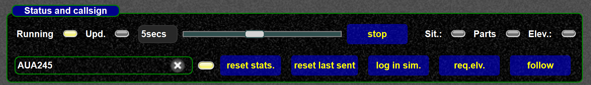
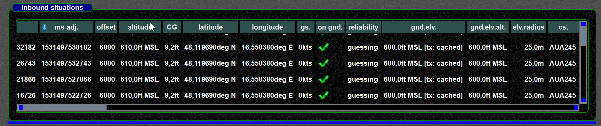
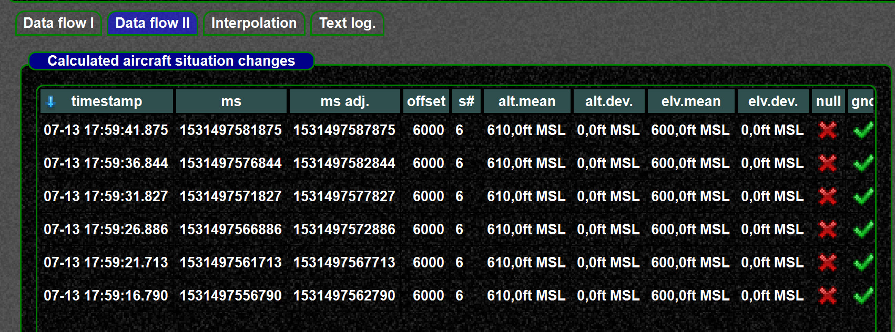
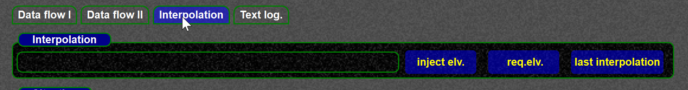
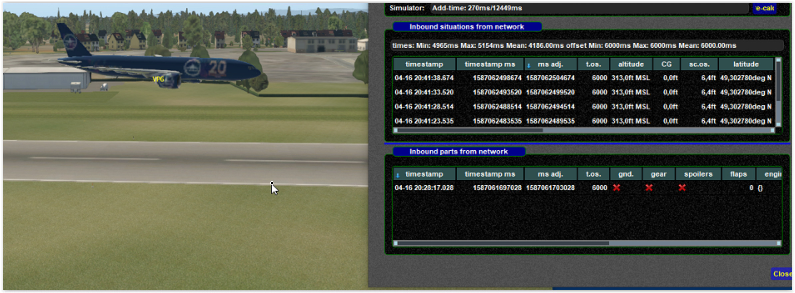
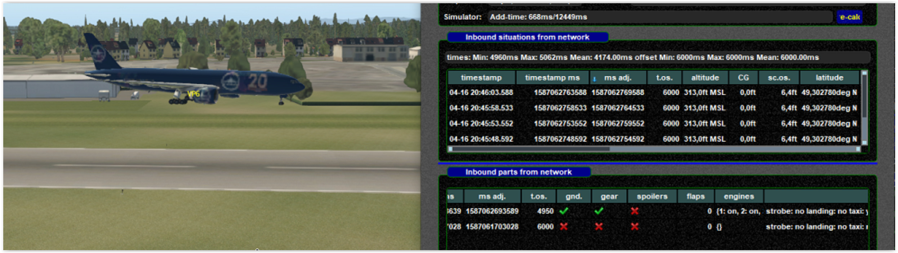

<!--
    SPDX-FileCopyrightText: Copyright (C) swift Project Community / Contributors
    SPDX-License-Identifier: GFDL-1.3-only
-->

The interpolation log. display allows to trace interpolation, checking elevations, inbound parts and situations.
It is most likely the easiest was to trace interpolations.
See also [interpolation examples](./interpolation_examples.md).

Interpolation log. files are here: [Find log files](./swift_log_files.md#interpolation-log-files)

- Use `.drv intdisplay` to launch the window

    {: style="width:80%"}

- You can start logging by entering a callsign.
  This is the same as starting logging from interpolation setup or via dot command, only easier.

    {: style="width:80%"}

- You can also request the scenery ground elevation from the simulator.
- On the "inbound page" you are seeing the incoming situations and parts from the network

    {: style="width:80%"}

- Especially the altitude information and the used elevation is a useful information there
- The calculate aircraft change states can be checked from the next page

    {: style="width:80%"}

-   On the "interpolation page" you can check the latest interpolation or inject a scenery ground elevation for testing

    {: style="width:80%"}

## Examples

Other side sending no gnd. flag, no gear ...

{: style="width:80%"}

now the other side updating gear and gnd. and sending some lights

{: style="width:80%"}
