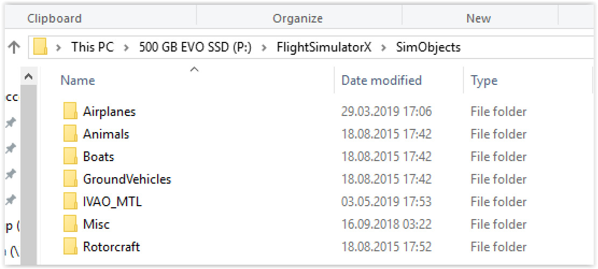
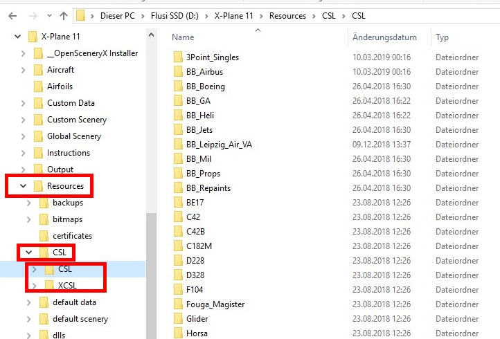
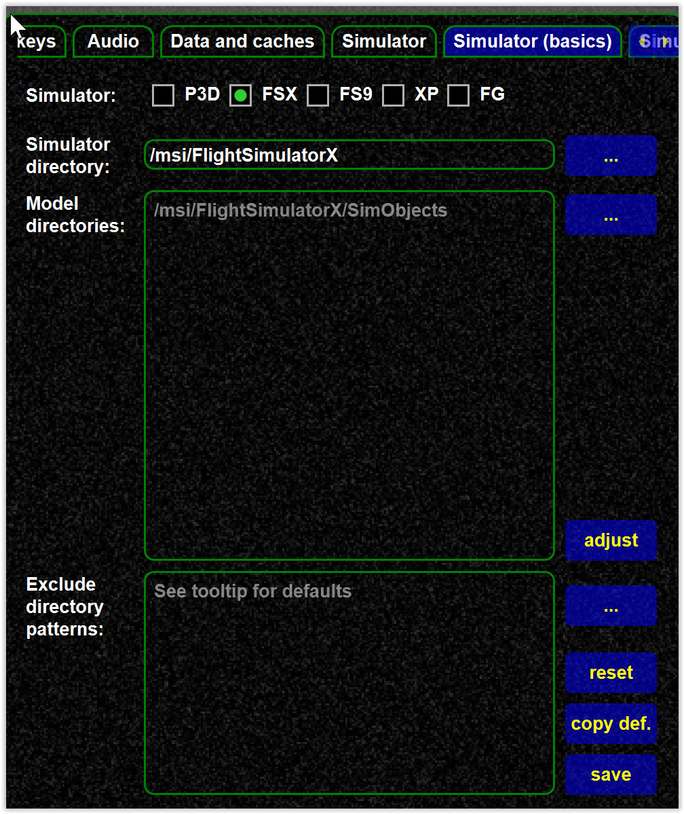
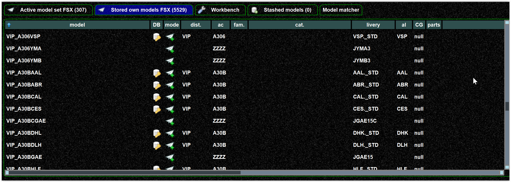
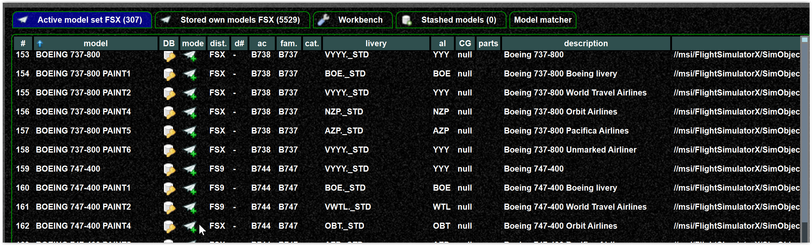
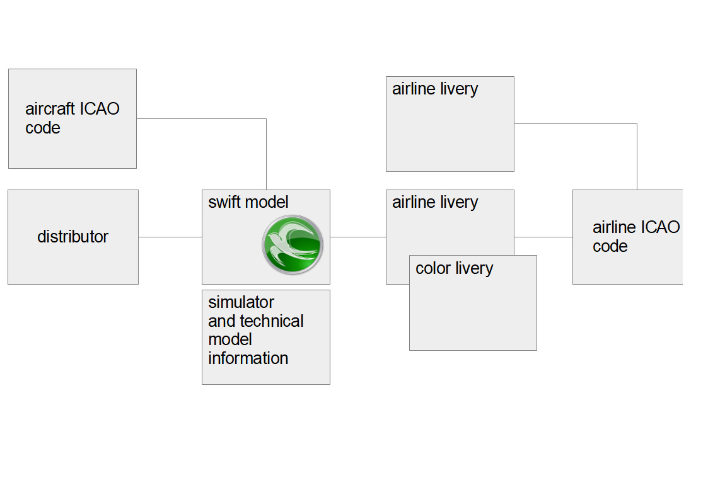

<!--
    SPDX-FileCopyrightText: Copyright (C) swift Project Community / Contributors
    SPDX-License-Identifier: GFDL-1.3-only
-->

## Own stored models

If you run your simulator (XPlane, P3D, ...) you will install aircraft models to display other pilots.
In XPlane those are the BlueBell or XCSL models, in P3D/FSX the FLAI or WoAI models for instance.

Those models we call **"stored own models"**, and they are located on your hard drive.
Such a directory structure may look like here (FSX/XPlane examples):

{: style="width:70%"}

{: style="width:70%"}

Now *swift* wants to create a list of your installed models (to know where and what they are).
Normally we search the default directories, but you can also specify the directories in the settings.

{: style="width:50%"}

In the same step we will use the mapping data (explained below, metadata from the DB) to further annotate your models (i.e. provide more details).
This list may look like here in the mapping tool.
The ones with the DB icon are those having a mapping in the DB, the other ones do not.

{: style="width:80%"}

So in a nutshell:

- the "own models" are those you have installed plus the database data if available.
- if you move your installed models, you need to redo this step.

## The model set

Now you need to tell *swift* **which of the own models you want to use for model matching** (explained below).
You simply pick those from "own models" and move them into the model set.

{: style="width:90%"}

Those models you see here are the ones use for model matching.
This explains why your model set needs to be updated when you move your model directories.

## Matching

Matching is the process of finding the most suitable aircraft model of your simulator to represent the other parties aircraft.

!!! note

    If everyone would have the same simulator with the same models installed, matching was not needed.

## Mapping

Mapping is the process of assigning [metadata](https://en.wikipedia.org/wiki/Metadata) to a simulator model (i.e. a model used for air traffic in your simulator).
It describes the model in a way it can be used for model matching.

Why do we need such metadata (and not just use the data from the aircraft files)?

- the data in the model files are a) often wrong, b) unstructured (different attributes used) or c) missing.
  This is at least true for P3D/FSX models
- not all attributes (e.g. colors) are covered,
- and we can not extend those metadata for future features
- different simulators (i.e. XPlane, P3D, ...) use different concepts, namings, etc., so we need to unify
- there is no existing concept to structure liveries
- and maintenace is a nightmare.
  If an airline changes its name, ICAO code or such, we have to modify simulator files.

Mapping is "objective" and describes the model as what it is, never ever change the description to just change what you want to see in your simulator.
A "DLH A320" is a "DLH A320" and not a "BAW A320".
So do not change mapping data just to see that very plane in a scenario where another pilot flies a "BAW A320".

## Entities (of a mapping)

{: style="width:70%"}

1. Aircraft ICAO: Each simulator model has an aircraft ICAO code assigned.
   An aircraft ICAO is not unique (means there are usually multiple similar codes).
   Always use the most appropriate one (normally decided by manufacturer).

2.  Distributor: The package or software vendor the model belongs to.
    Mostly needed for filtering and sorting, but also use for personal
    preferences (i.e. the model of higher preference will be used first)

3.  Livery: Describes how the model looks like.
    There are two types of liveries:

    1. Airline liveries: The livery belongs to an airline (identified by an airline ICAO code).
       There are 1..n airline liveries per airline.
       So it is important to understand an airline can more than one livery.
    2. Color livery: Not all aircraft belong to an airline.
       Smaller aircraft such as `C172` will be described by it primary (normally fuselage) and secondary color (normally tail).
       There is a set of predefined color liveries and the closest combination is to be used.

Role of airline ICAO codes:

- Mainly used to identify or search the airline livery.
- swift distinguishes between real an virtual airlines (VA).
  We use pseudo codes for virtual airlines (e.g. `VDLH` for virtual Lufthansa)

!!! important

    Airline ICAO codes are not unique, there can be ambiguous codes.
