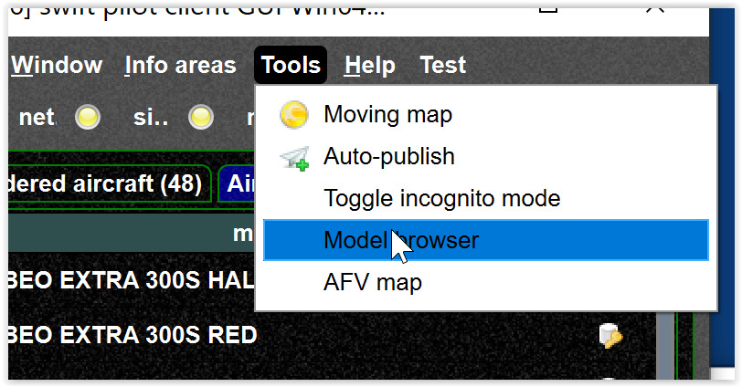
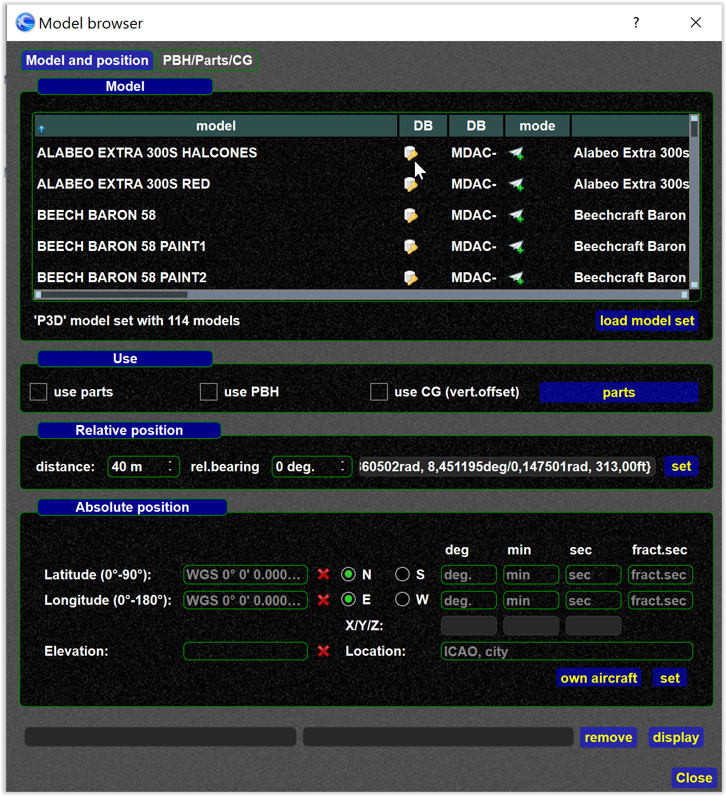

<!--
    SPDX-FileCopyrightText: Copyright (C) swift Project Community / Contributors
    SPDX-License-Identifier: GFDL-1.3-only
-->

The model browser allows you to test AI/CSL/XCSL models.

{: style="width:70%"}

To use the browser connect with the simulator but do not connect with the network (VATSIM; ..)

{: style="width:70%"}

Now you can place any model in any location and test parts, lights, ...
