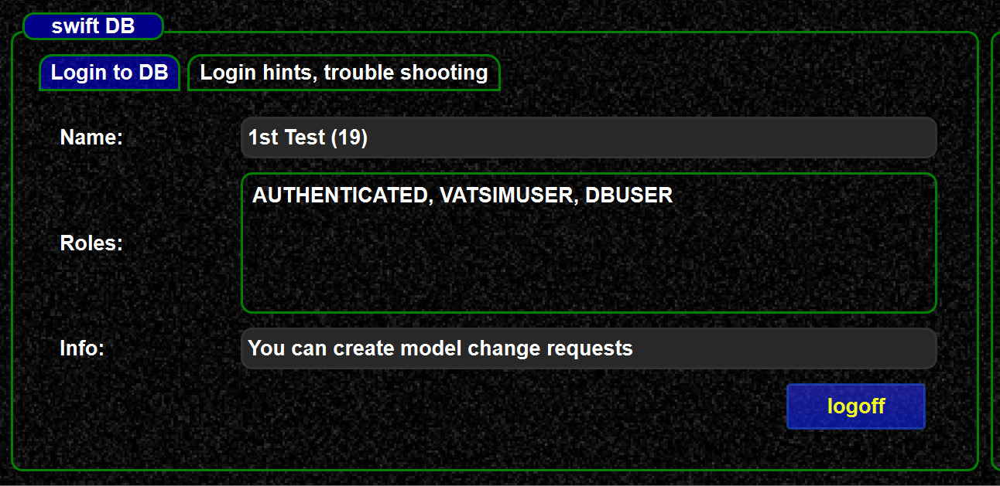

<!--
    SPDX-FileCopyrightText: Copyright (C) swift Project Community / Contributors
    SPDX-License-Identifier: GFDL-1.3-only
-->

swift database roles

| role           | meaning                                                                                              |
|----------------|------------------------------------------------------------------------------------------------------|
| -              | normal user without role. Such user only see self adminstration in the web UI                        |
| alpha          | can access alpha program downloads                                                                   |
| bulk add       | can directly add model mappings, but not change. In order to directly edit `bulk` role is required   |
| bulk           | can perform direct uploads from swift mapping tool                                                   |
| mapping admin  | can create new liveries, aircraft ICAOs, airline ICAOs                                               |

When you login in the mapping tool, you will see your roles here:

{: style="width:70%"}
