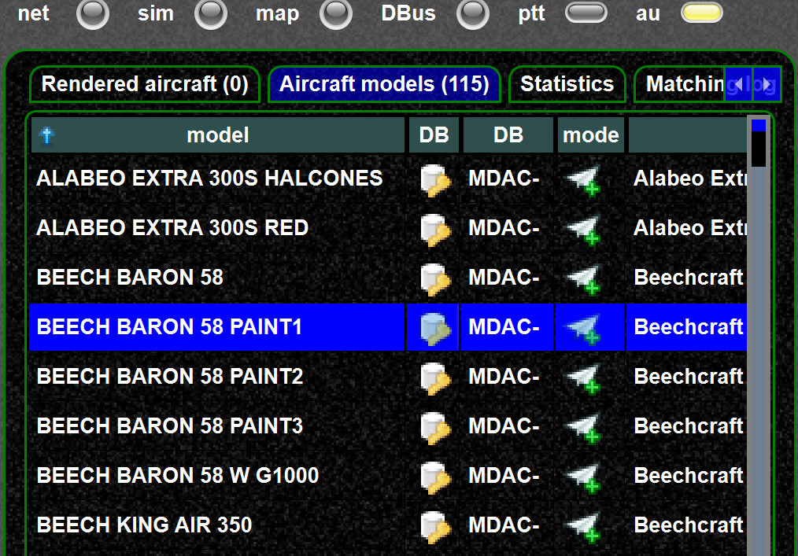
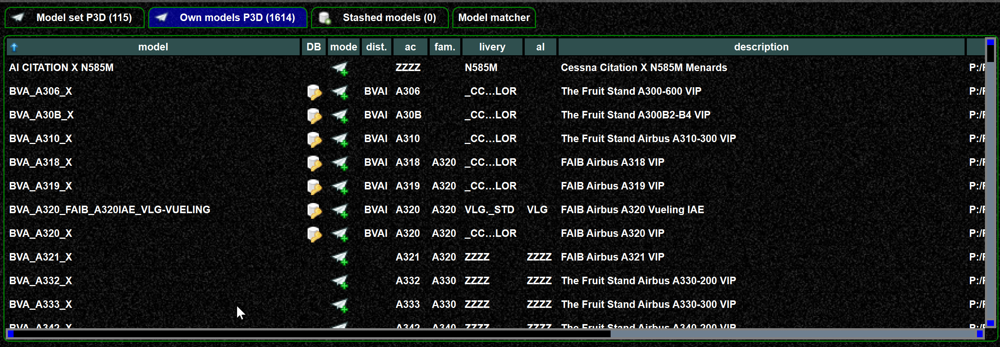
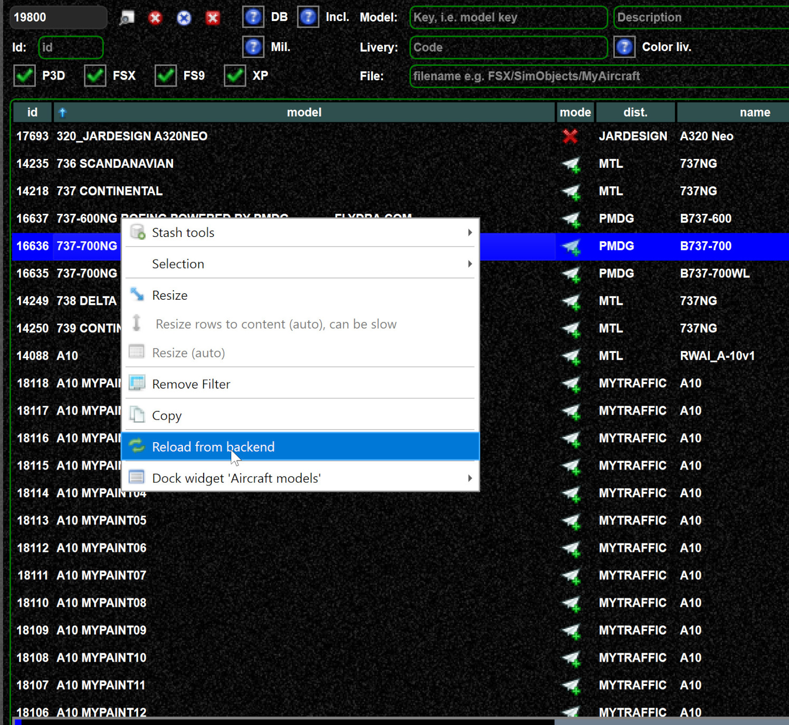
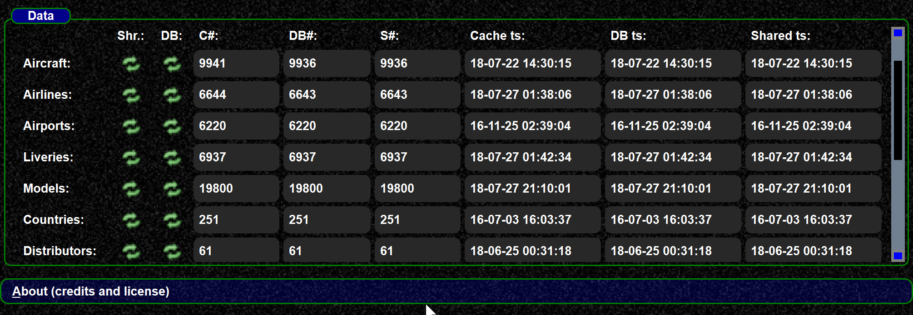
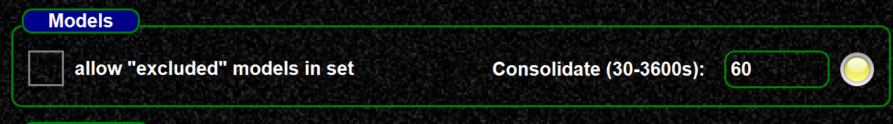
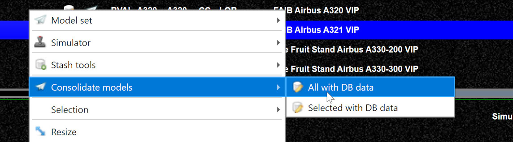

<!--
    SPDX-FileCopyrightText: Copyright (C) swift Project Community / Contributors
    SPDX-License-Identifier: GFDL-1.3-only
-->

## The DB icon

You can see by the database icon if a model has already database data or not.
The concept is the same for all view.
Here you can see 2 examples, in the pilot client view every model has a DB entry, in the mapping view not.

{: style="width:70%"}

{: style="width:70%"}

!!! note

    To use a model without DB data you need to enable this in your settings.

## I do not see my mapping, why?

I have created a mapping, but still do not see a DB icon?
This can have several reasons:

- depending on your DB role you can only create change requests, see [this page](./mapping_db_roles.md).
  **Change requests have to be released**, before that you do not see the very model.
    - Actually it is easy to check, you can just go to the [datastore model view](https://datastore.swift-project.org/page/publicaircraftmodel.php) and check if the model is there.
      Just sort by date latest first, then you should see your model at top.
      If not, it has to be released first.
    - you can also check your roles on the login page.

        {: style="width:70%"}

-   If the model is in the DB, either the shared files are not yet generated, or in the mapping tool you just have to update the view.
    - In the mapping tool you can also update to the latest DB data via the context menu

        {: style="width:70%"}

    -   If you really want to see the details of the data, you can check them in the launcher's update view.
        There you can see en detail the status of the shared data, the cache, and the DB data.
        The cache data are the ones you are using in swift.

        {: style="width:70%"}

        NOTE: If you really need to update to very last data for testing, you could do it here.

- Once you have latest DB data in your cache, you need to consolidate your models and model set.
  If you do not know what consolidation is, see [this page](./../../documentation/swift_data/why_consolidation.md).
    - You can consolidate via the background updater which automatically consolidates from time to time

        {: style="width:70%"}

    - You can consolidate with the context menu

        {: style="width:70%"}

    - swift pilot client can consolidate when you download new models, see [this page](./../../documentation/flying/update_model_data.md)
