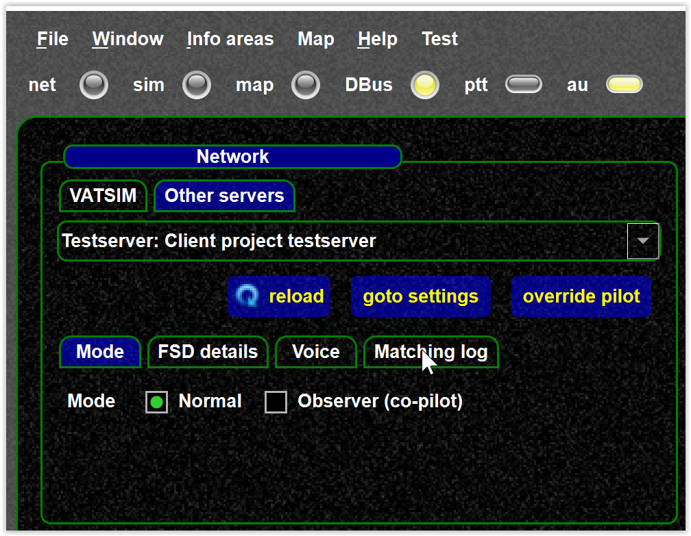
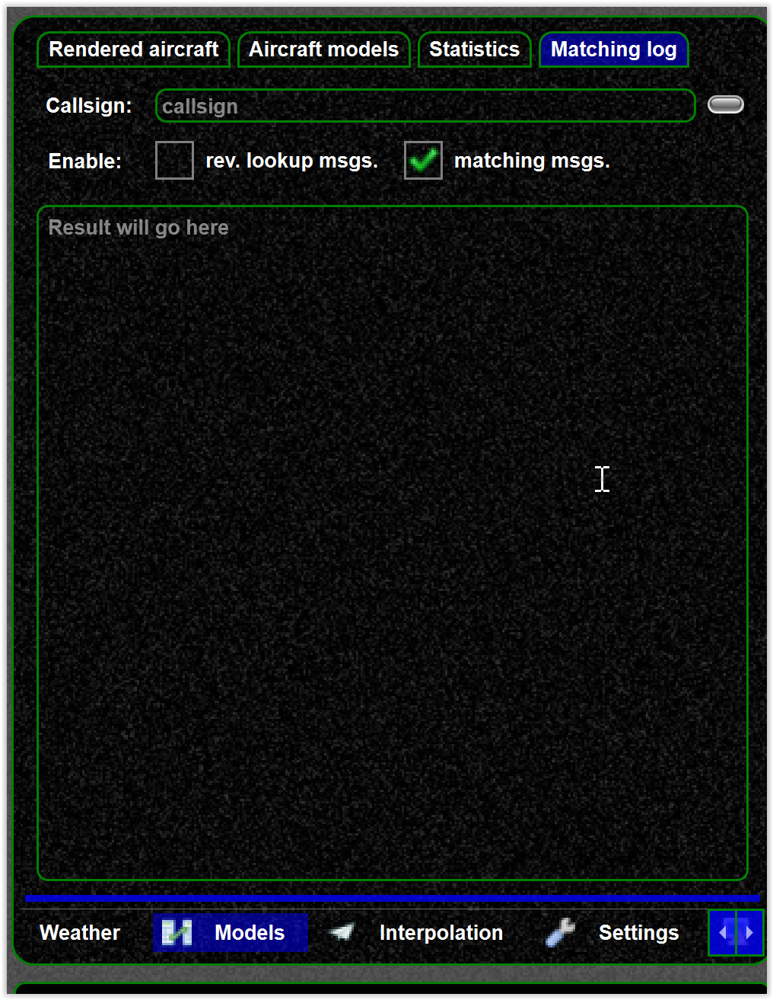
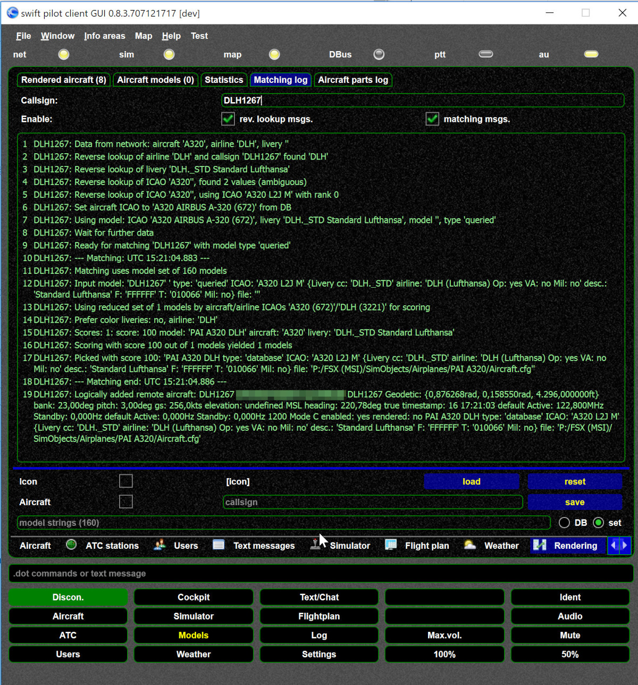
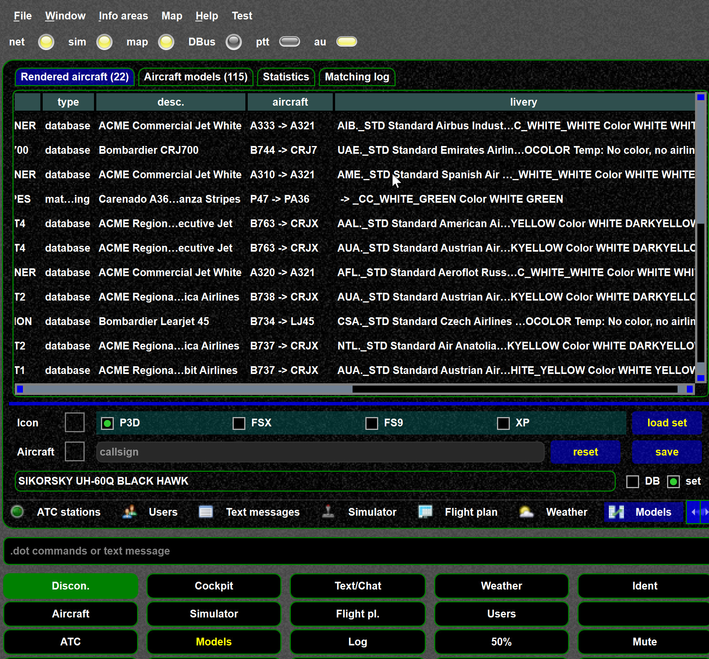

<!--
    SPDX-FileCopyrightText: Copyright (C) swift Project Community / Contributors
    SPDX-License-Identifier: GFDL-1.3-only
-->

## Enable matching logs

!!! warning

    You need to enable the matching messages before you login to the network

{: style="width:70%"}

You can enable `matching logs` before you login on the login page (matching log tab) or on the model matching log tab age.
Both ways are shown below.
**In recent *swift* version a simplified log is enabled as per default**.

{: style="width:70%"}

{: style="width:70%"}

## Using matching logs

Then you can obtain a detailed information about the mapping steps per callsign.
In case you need to report a bug please paste the matching messages.

!!! tip

    The matching result also depends on the settings

{: style="width:70%"}

If you need a quick overview you can use the model view to see how the aircraft and livery a mapped.

{: style="width:70%"}

## Uploading a matching log

If you want to discuss results on [our Discord channel](https://discord.gg/R7Atd9A), copy the matching log in a file and upload it for further analysis.
**Make sure you copy the whole matching log**.
**Upload as file.**
