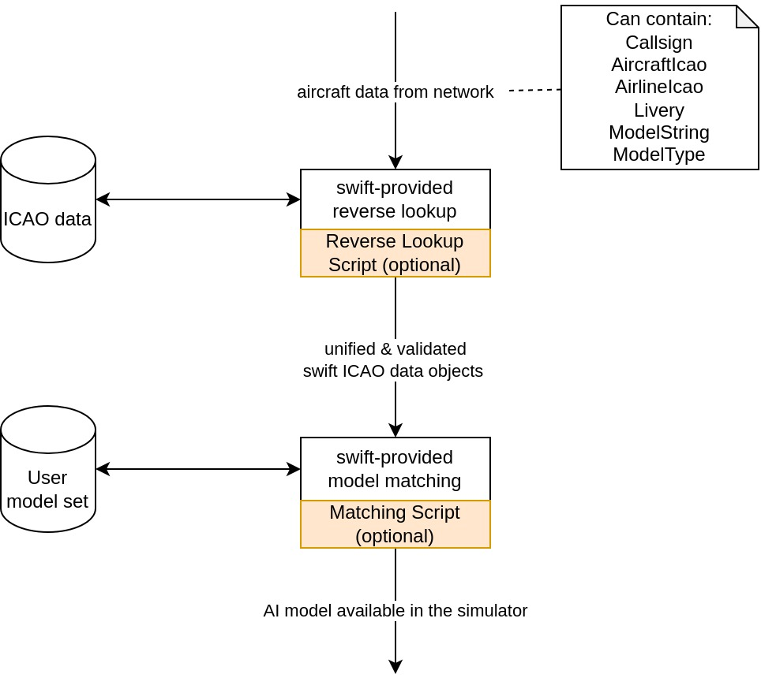
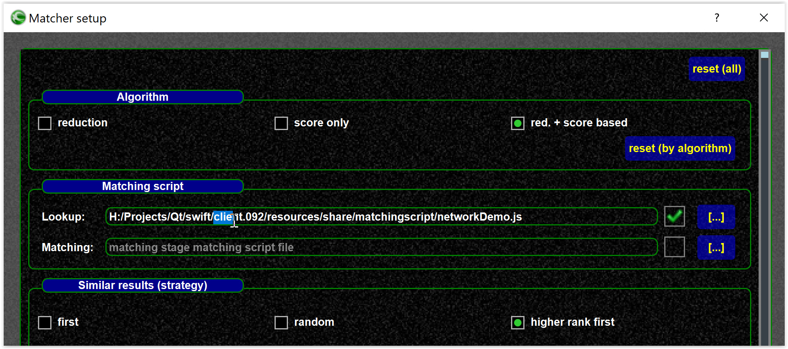

<!--
    SPDX-FileCopyrightText: Copyright (C) swift Project Community / Contributors
    SPDX-License-Identifier: GFDL-1.3-only
-->

!!! warning

    Matching script is an advanced topic, which means you write your own logic for matching in JavaScript.
    This code is your own responsibility, we cannot help you debugging and fixing it.

There are many cases where users want to apply their own model matching logic.
Many cases can be configured in the settings.
Matching script allow to write your own matching logic beyond the scope of the settings.

## How matching works in *swift*

1. When we received aircraft data from the network (we receive aircraft ICAO and airline strings, the callsign, maybe the model string or livery) we try to turn these data into swift database ICAO data.
  By that we validate the network data, unify them and turn them into our objects.
  This is what we call **reverse lookup**.
2. Then we use these unified data and try to find the best match in your model set.
  This is what we call **model matching**.

{: style="width:60%"}

swift exposes some of its APIs to matching script:

- A wrapper for the swift database web services
- A wrapper for the model set (of the user)
- In/Out objects for the network data and the matching state

## Matching script {#matching-script-1}

You can modify the results of both steps in *swift* matching script.
There are 2 independent scripts for that as you can see, so you can use the stage most suitable for your needs.

The results of a matching script may vary depending on

- your model set
- your matching settings

## Testing matching script

A good way to test matching script is in the mapping tool, you can enable and change your script there and see the output.

## Technical details

See [this page](./matching_script_technical.md)

## Some general information about using matching script

- with matching script you can define your individual matching logic, but the code for that is your responsibility (you maintain it, you debug it)
- Matching script is meant for smaller adjustments, not re-writing the whole matching logic!
- You need to know JavaScript to write matching script, but you need to be no JavaScript expert.
- Place your matching script files outside the *swift* folders so they are not overridden/deleted when you install/uninstall *swift*.
- Use your favorite text editor to write your own matching script (JavaScript) code.
- You matching script might be specific for your model set, i.e. if you change your model set or give the code to others it might not work as intended.
