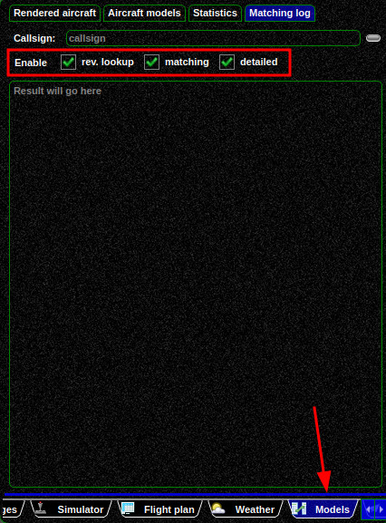

<!--
    SPDX-FileCopyrightText: Copyright (C) swift Project Community / Contributors
    SPDX-License-Identifier: GFDL-1.3-only
-->

This document covers some technical details for matching script programmers.

The matching script consists of a JavaScript file containing an anonymous function:

```js
(function() { /* your code goes here */ })
```

Inside the function, the following objects are available:

- ``inObject``: Object with all the data from the network and the swift-provided reverse lookup stage
- ``outObject``: The object that should contain the script results.
    In the beginning, this object contains the same content as ``matchedObject`` and can be changed by your script.
- ``matchedObject``: Object with the model (and additional information) deduced so far in previous stages. In the reverse lookup script, this is identical to ``inObject`` as no further stages were already executed.
- ``modelSet``: User's current model set. Not available in reverse lookup
- ``webServices``: Wrapper to access the swift web services

As already stated, your script must return the ``outObject``:

```js
(function() {
    /* Do some modifications of outObject here */
    return outObject;
})
```

## Using properties

The provided objects contain properties that you can use.
These properties are listed in the [``matchingscript.h``](https://github.com/swift-project/pilotclient/blob/main/src/blackmisc/simulation/matchingscript.h) as ``Q_PROPERTY``.


| Javascript Object   | Corresponding C++ class |
|---------------------|-------------------------|
| ``inObject``        | ``MSInOutValues``       |
| ``outObject``       | ``MSInOutValues``       |
| ``matchedObject``   | ``MSInOutValues``       |
| ``modelSet``        | ``MSModelSet``          |

The second parameter of ``Q_PROPERTY`` is the name of the property in JavaScript.
They can be used in the scripts as like as follows:

```js
if (outObject.airlineIcao == "ABC") {
    outObject.aircraftIcao = "A320";
}
```

Some properties are read only, and you can see the type from the ``Q_PROPERTY`` definition.

## Using functions
Some of the provided JavaScript objects contain functions that can be invoked by your script.
These functions are listed in the [``matchingscript.h``](https://github.com/swift-project/pilotclient/blob/main/src/blackmisc/simulation/matchingscript.h) as ``Q_INVOKABLE``.
They can be invoked like this:

```js
var contains = modelSet.containsModelString("C172");
```

## Effect of the ``outObject`` properties on reverse lookup and matching

After executing the script, the following properties are used by swift to influence the reverse lookup or matching:

- ``logMessage``: Contains a string message that is logged individually for each callsign/aircraft the matching script was invoked for.
    See also [this section](#log-messages-from-the-matching-script).
- ``modified:`` Boolean flag that **must** be set to ``true`` if any of the other properties should be used.
    If set to ``false``, the data from this script run are discarded.
- ``rerun``: When set to ``true``, rerun the stage that runs before this script but without executing the script again.
    Example: When this is set to ``true`` in the reverse lookup script, the swift-provided reverse lookup stage is executed again (it was already executed before the script was invoked).
- ``dbModelId``: New model ID. Set this to -1 if you do not want to set the model ID explicitly. This invalidates the model ID as ``outObject`` is prepoulated with data from ``matchedModel``.
    When this property contains a different value than -1, the model is fetched from the webservices.
    If the fetched model is valid, all other properties are discarded and the specified model is used.
- ``modelString``: String with a new model string. Set this to empty if you do not want to set it explicitly.
    This invalidates the model string as ``outObject`` is prepoulated with data from ``matchedModel``.
    The model string is first searched in the webservices and if not found there in the user's model set.
    If the model string is valid, all other properties are discarded and the specified model is used.
- ``aircraftIcao``: Set the aircraft ICAO as a string. The webservices are used to find more information about the aircraft ICAO.
    If the webservice search was unsuccessful, the aircraft ICAO as a string is used anyway.
- ``liveryId``: ID of the livery to use.
    The corresponding database entry is always fetched from the webservice.
    Invalid livery IDs might lead to some default livery.
    All airline ICAO options (below) are skipped if this property is set.
- ``airlineIcaoId``: ID of the airline ICAO to use.
    Further data about the ID is gathered from the webservices.
    If the ID is not found via the webservices, some default/empty airline will be used.
    As a livery, the "standard" livery for the specified airline is used.
    This option is discarded when using ``liveryId``.
    This property takes precedence over ``airlineIcao``.
    The ``airlineIcao`` property is discarded in this case.
- ``airlineIcao``: Airline ICAO string to use.
    Further data about the airline ICAO string is gathered from the webservices.
    If the ICAO is not found via the webservices, some default/empty airline will be used.
    As a livery, the "standard" livery for the specified airline is used.
    This option does not work when using ``liveryId`` or ``airlineIcaoId``.

## Log messages from the matching script

The ``outObject`` contains a ``logMessage`` property to display a log message for each invokation.

!!! warning

    These messages are **not** displayed in the normal swift application log!

### swiftgui
In swiftgui, this logging only works if the corresponding logging (reverse lookup or matching) **and** "detailed" logging is enabled on the ``Models->Matching Log`` page.
The log is shown on the same page after entering a callsign.

{: style="width:50%"}

### swiftdata

Within the model matcher of swiftdata, the script log messages are always displayed.

## Error logs
If the script for some reason fails to execute (syntax errors, ...), a log file with the cause of the error is created at the following locations:

- for the reverse lookup script: ``<SWIFT_LOG_DIR>/logMatchingScriptReverseLookup.log``
- for the matching script: ``<SWIFT_LOG_DIR>/logMatchingScriptMatchingStage.log``

To find your log directory, see [this page](./../swift_log_files.md).

## Example scripts

Check out the `matchingscript` directory for examples: `<SWIFT_INSTALL_DIR>\share\matchingscript`.
