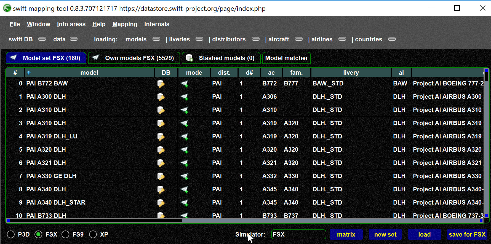
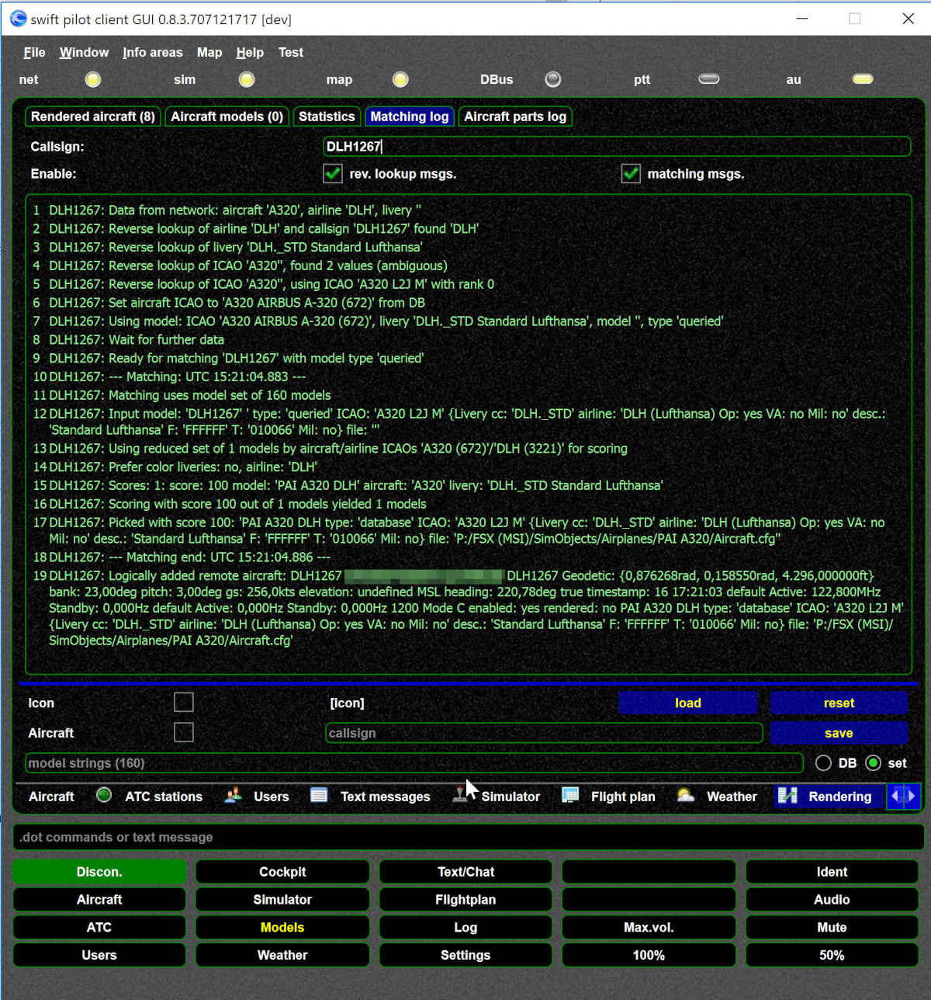

<!--
    SPDX-FileCopyrightText: Copyright (C) swift Project Community / Contributors
    SPDX-License-Identifier: GFDL-1.3-only
-->

## Fundamentals

- [Understanding the fundamentals](./../mapping_matching_model_set_theory_concepts.md)
- Matching depends on the settings: [Matching script](./matching_script.md)
-   Without model set model matching is not possible. So check that you have created a model set:

    - Model set in swift pilot client

        {: style="width:70%"}

    - Model set in swift mapping tool

        {: style="width:70%"}

## Analyze your models and matching

-   Use the matching messages to understand how a particular aircraft is matched.

    {: style="width:70%"}

- You can also see some mapping details in the models view.
  You can see how the ICAO code of the aircraft is mapped or how the livery is mapped `from -> to` or `[=]` (same code).

    {: style="width:70%"}

- In the statistics view you can check if you have a model for a particular ICAO code combination installed

    {: style="width:70%"}

- In the mapping tool you can check the coverage of your model set:

    - Create matrix

        

    - Example matrix

        
