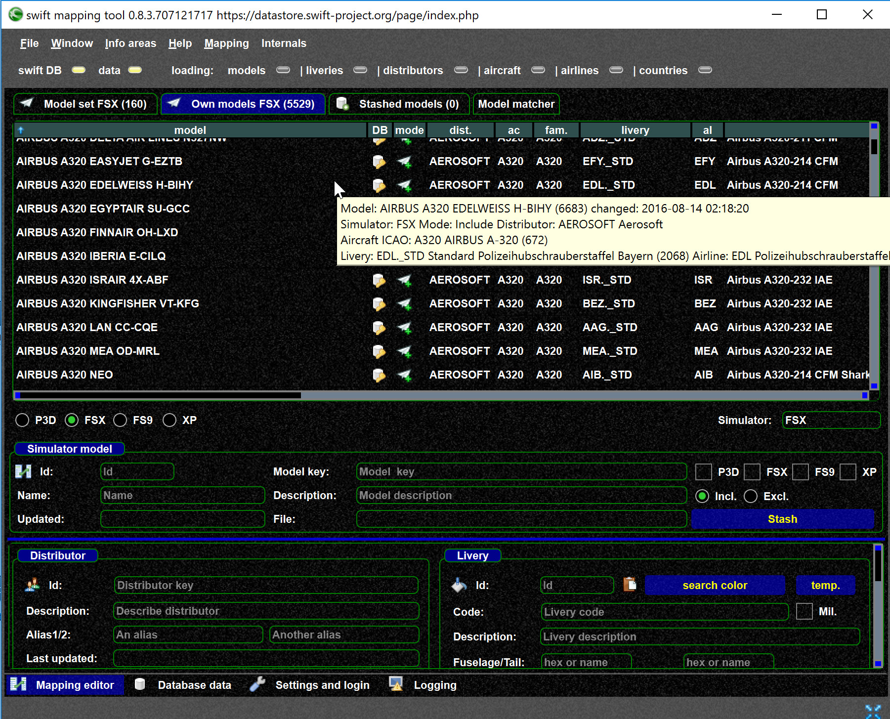
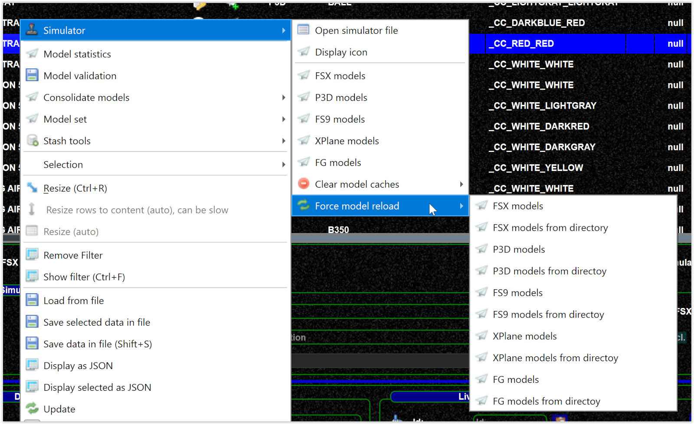
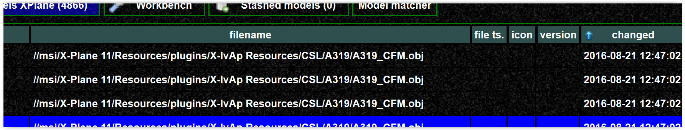
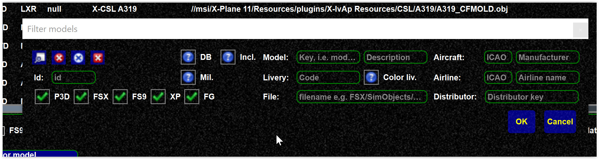
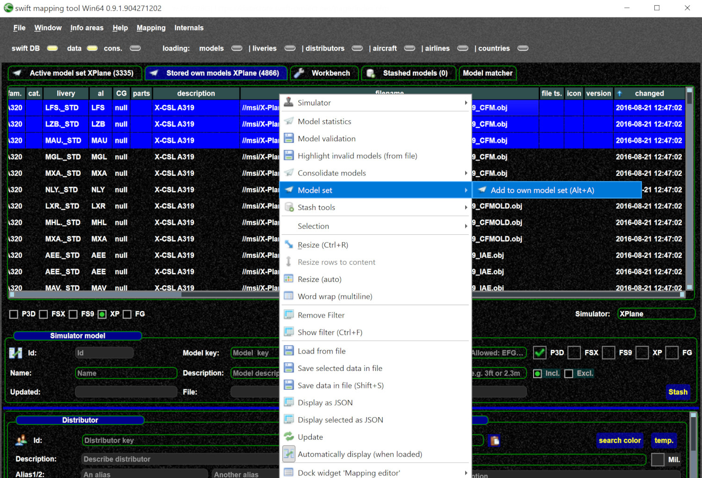
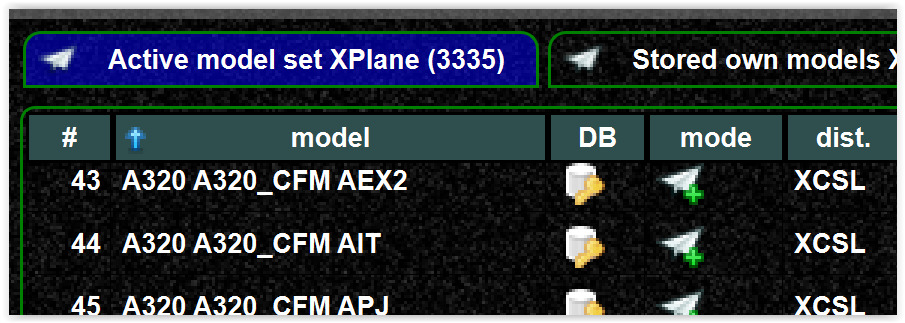
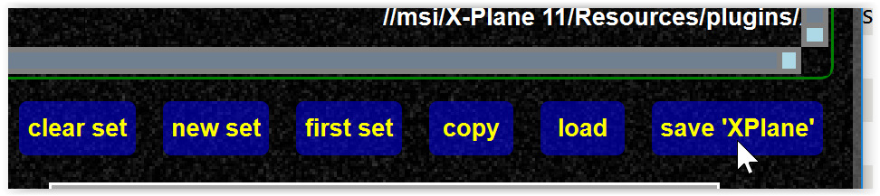

<!--
    SPDX-FileCopyrightText: Copyright (C) swift Project Community / Contributors
    SPDX-License-Identifier: GFDL-1.3-only
-->

If you have installed new models there is no need to re-create your model set.

There are 2 steps involved:

- update your stored models, in most cases it is the easiest way just to force a reload
    - In the mapping tool, go to the "Own models" tab.

        {: style="width:70%"}

    - If you need to **reload your models** you can use the `FORCE RELOAD` context menu.

        {: style="width:70%"}

-   then you find the new models ad add them to the model set
    - you can sort by column to find the latest models

        {: style="width:70%"}

    - or you filter if you know what you are looking for

        {: style="width:70%"}

    - You can add the models by (key ``ALT+A``)

        {: style="width:70%"}

-   Do NOT forget to save your **model set**

{: style="width:70%"}

{: style="width:70%"}
