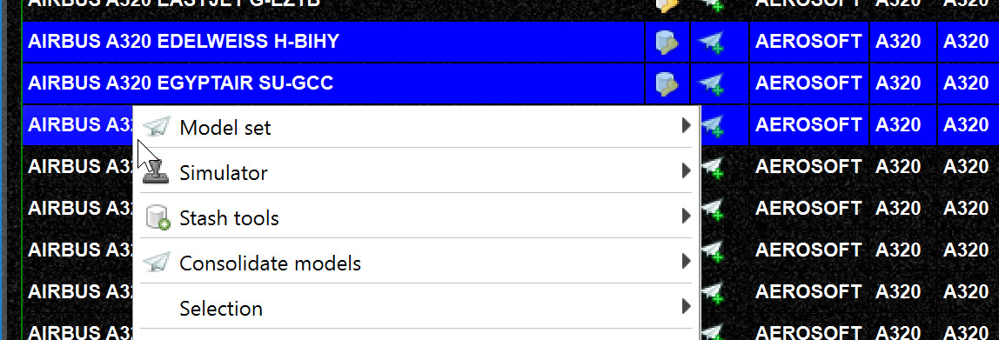
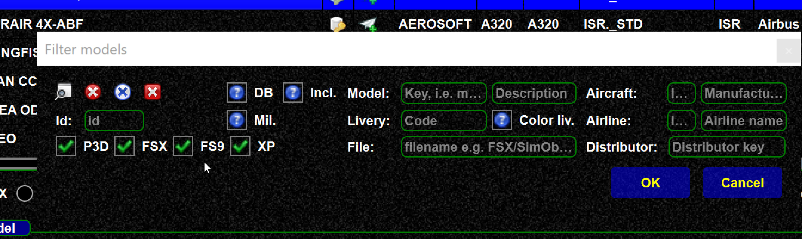
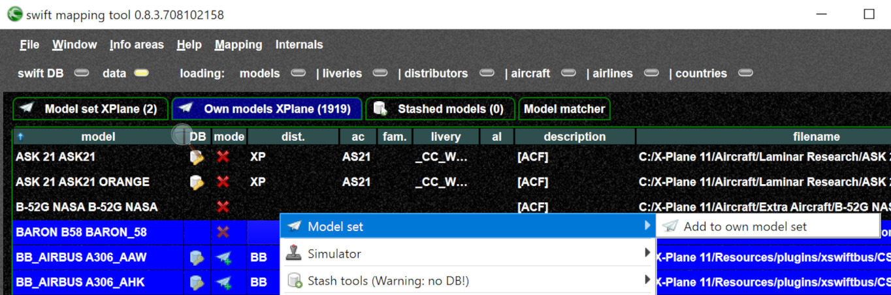
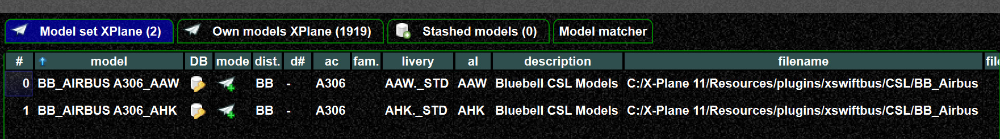
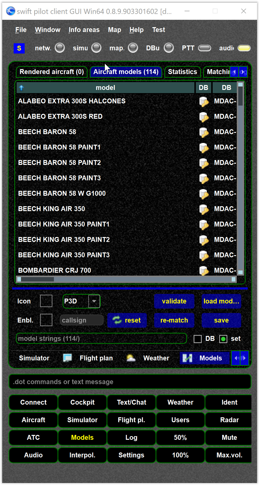

<!--
    SPDX-FileCopyrightText: Copyright (C) swift Project Community / Contributors
    SPDX-License-Identifier: GFDL-1.3-only
-->

## Which models to use?

This is up to you, but maybe some hints:

- For XPlane:
    - BlueBell is a good option
    - You can mix BlueBell with XCSL, use it alone, use BlueBell alone etc.
- For VATSIM and FSX/P3D FLAI is a good choice
    - For instance start with FLAI and the standard FSX/P3D models
- For Flightgear:
    - Models within `FGDATA/AI/Aircraft` can be used.

Some general tips:

- Do not simply add a huge bunch of models to your set, choose wisely
- Add the default simulator models (if applicable) as models so they can be used if no other model is found
- Start with one additional model library on top of that
- Gradually add for specialized models as needed.

## Installed models vs. model set

If you do not understand the difference (i.e. what a model set is), see [this page](./../mapping_matching_model_set_theory_concepts.md)

## Creating a model set or recreate model set

!!! warning

    It is the users responsibility to check if he is entitled to use the models in the set for online flights with a particular network.
    swift is an open source client for multiple networks, but this does not mean you are allowed to use it with all the networks.

- In the mapping tool, go to the "Own models" tab.
  The models here depend on your model directories

    {: style="width:70%"}

- If you need to **reload your models** you can use the `FORCE RELOAD` context menu.

    {: style="width:70%"}

- You can add to your model set via the context menu.

    {: style="width:70%"}

- If you want to clear/re-create your model set: go to the model set where can delete your models by `CTRL+A` then `DEL` (as one of many possibilities).
- If possible, only use models with DB mapping (see DB icon)
- You can filter the models, and then add all filtered models

    {: style="width:70%"}

- Excluded models are normally not used with a model set, see [this page](./../../documentation/swift_data/excluded_models.md).
  As you can see here, the excluded model is ignore when adding to the model set:

    {: style="width:70%"}

    {: style="width:70%"}

- Advanced topics:
    - [Remove model set duplicates](./removing_duplicates.md)
    - [Rank model set](./../../documentation/swift_data/ranking_modelset.md)

- Do not forget to save your model set
    - You can have as many sets as you like
    - Each set needs to be saved
    - Each simulator has its own set

## Model set rules

- Do not add models to a set which do not work or really exist
- If you install new models you need to update your model set and add the new models you want to use
- If you uninstall a model you need to remove it from the set, see [model set validation](./../../documentation/flying/model_set_validation.md)
- If you move your models around (i.e. change the model folder) you need to recreate the set to provide the new location.

## Check the model set in the client

You can load the model set in the client to see if you have model set.
If this view is empty AFTER you have pressed "LOAD MODEL SET" then something is wrong.
Especially if you are using the distributed *swift* version (i.e. core and distributed GUI) this is a good check.

You can also validate from there: [model set validation](./../../documentation/flying/model_set_validation.md).

{: style="width:70%"}
