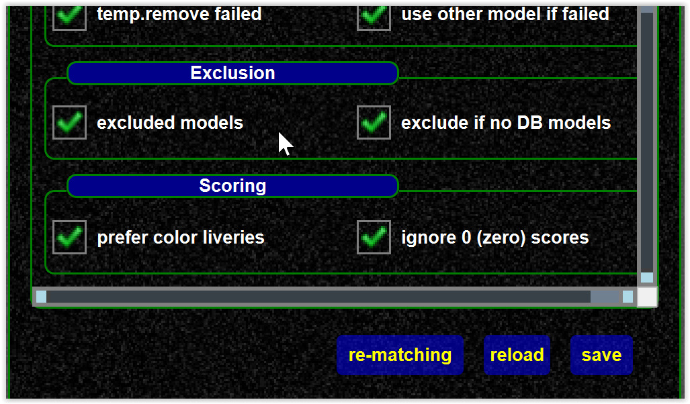

<!--
    SPDX-FileCopyrightText: Copyright (C) swift Project Community / Contributors
    SPDX-License-Identifier: GFDL-1.3-only
-->

- In general all models in the model set should have a DB entry, only those have correct data assigned

{: style="width:70%"}

- The default matching settings even ignore the models without DB entries

{: style="width:70%"}

However, there can be reasons where it make sense to include non DB models.
If you write your own matching script, then you might want to use raw models (see [matching script](./../model_matching/matching_script.md)) .

To use models without DB data, see [matching settings](./../../documentation/swift_gui/settings_page.md#matching).
