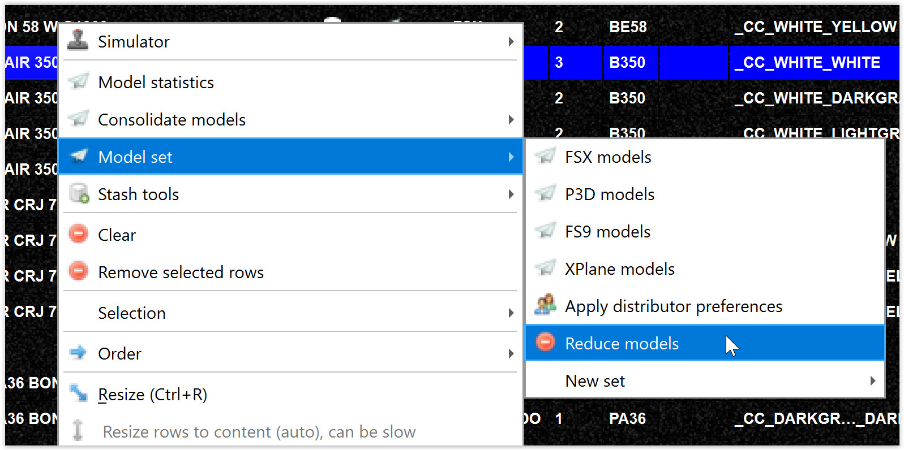
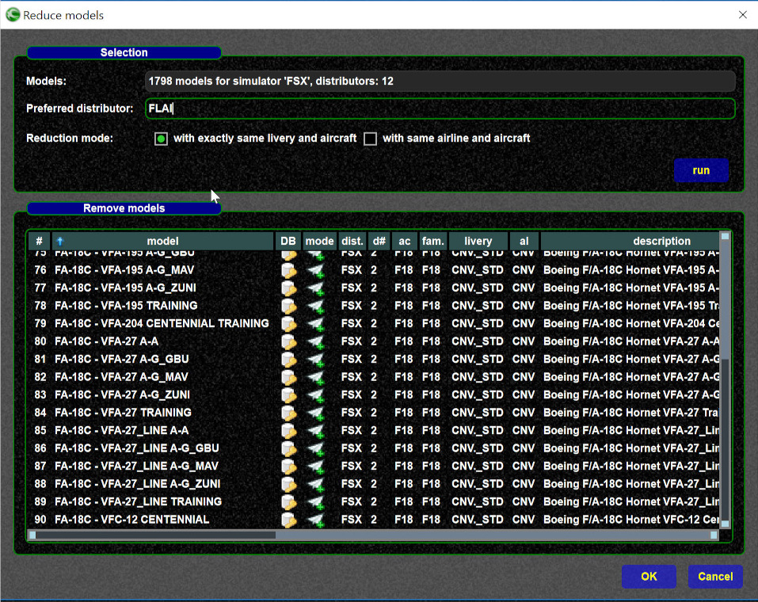
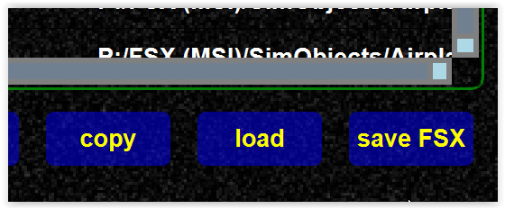
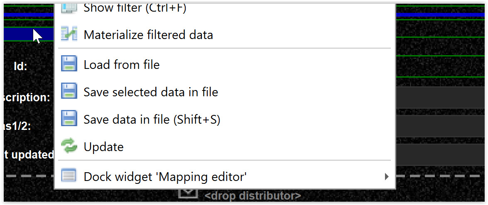

<!--
    SPDX-FileCopyrightText: Copyright (C) swift Project Community / Contributors
    SPDX-License-Identifier: GFDL-1.3-only
-->

Normally it does not make sense to keep more than one aircraft/livery combination in your set.
You can find out more about your model coverage from the statistics.

You can remove duplicates from the model set context menu.

{: style="width:70%"}

- Select your preferred distributor.
- "Run" -> now you see a list of possible remove candidate in the list view.
  You could remove entries from that list if you like.

    {: style="width:70%"}

- If you now press "Ok", the models from that list will be removed your set, however the changes are not saved yet.
- To finalize you need to "Save",

    {: style="width:50%"}

If you are unhappy with the changes, you can just "refresh" with the currently save data.
This will discard the changes.

{: style="width:50%"}
