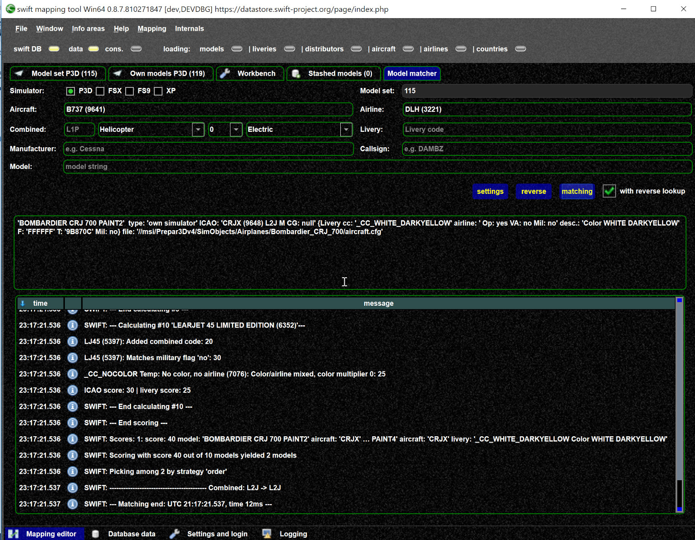

<!--
    SPDX-FileCopyrightText: Copyright (C) swift Project Community / Contributors
    SPDX-License-Identifier: GFDL-1.3-only
-->

You can test a model set in the mapping tool.
By entering input data on top you can check what the result would be.
You can change your settings ([matching settings](./../../documentation/swift_gui/settings_page.md#matching)) and see the impact.

