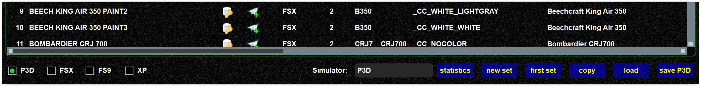

<!--
    SPDX-FileCopyrightText: Copyright (C) swift Project Community / Contributors
    SPDX-License-Identifier: GFDL-1.3-only
-->

In order to better understand the model coverage you can call the statistics.
There you get a general overview, or you can display the model matrix to see the model vs. airlines.

{: style="width:70%"}

{: style="width:70%"}

If you want to removed redundant models from the set, see [this page](./removing_duplicates.md).
