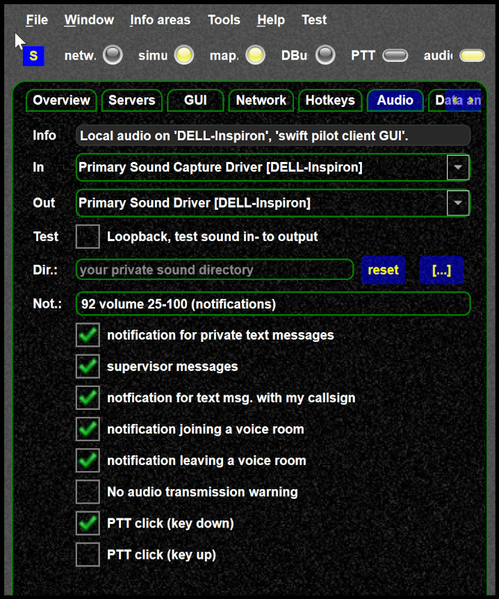

<!--
    SPDX-FileCopyrightText: Copyright (C) swift Project Community / Contributors
    SPDX-License-Identifier: GFDL-1.3-only
-->

- swift has no audio hot plug and play yet, audio device needs to be "on" when swift is started
- Check that the notification sound is enabled in the settings

    {: style="width:50%"}

- Check the notification sound volume
- You can test each sound by check/uncheck the sound, that will play it
- On Windows you can check if sound for *swift* is enabled

    {: style="width:70%"}
