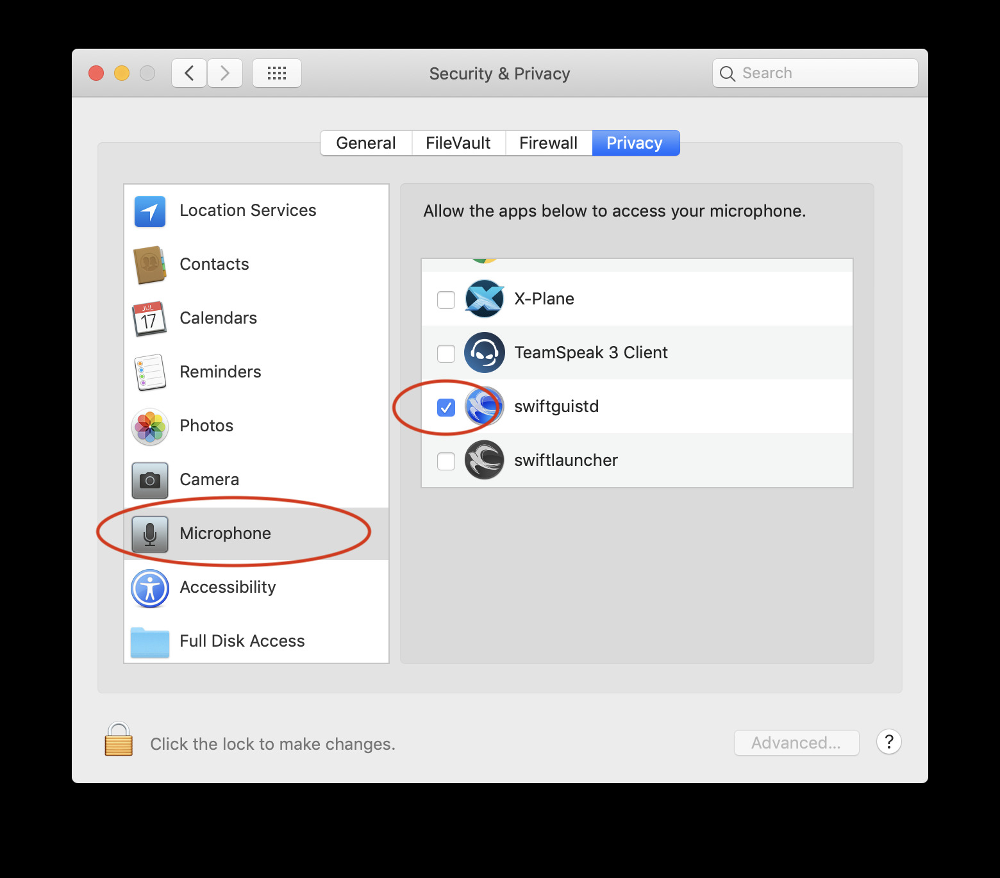
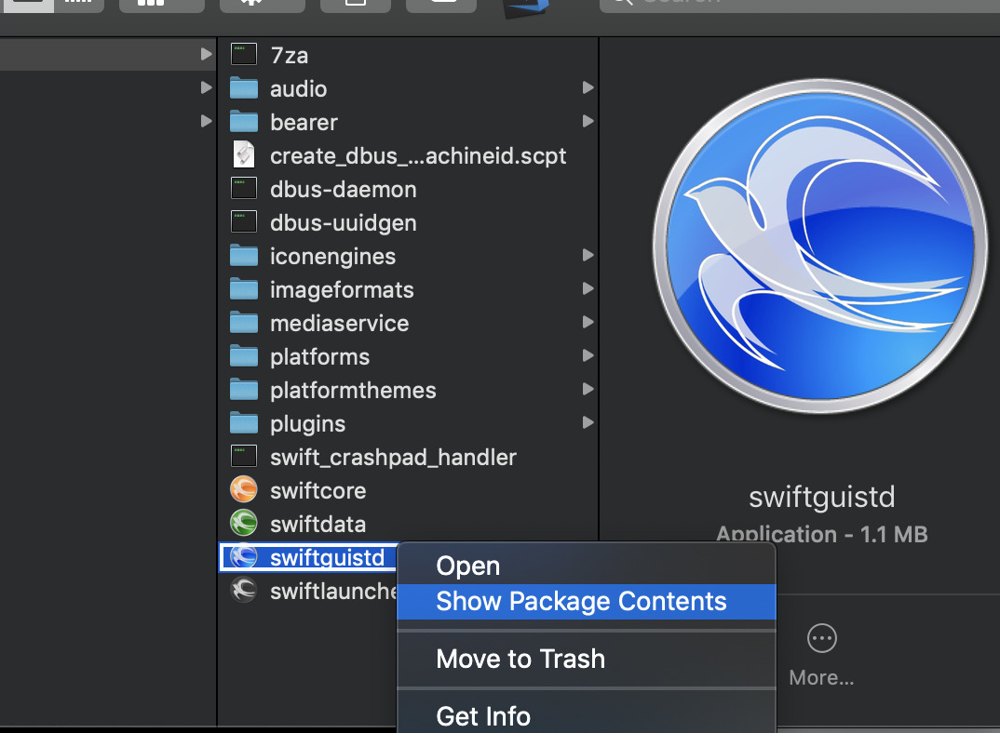
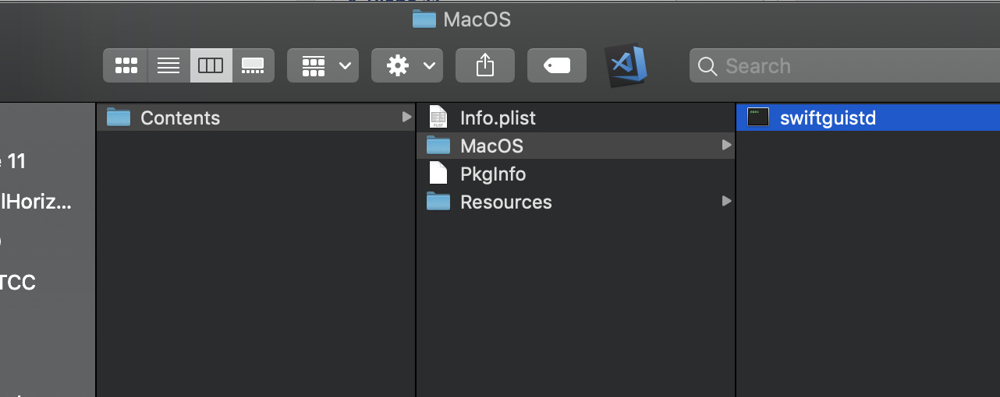
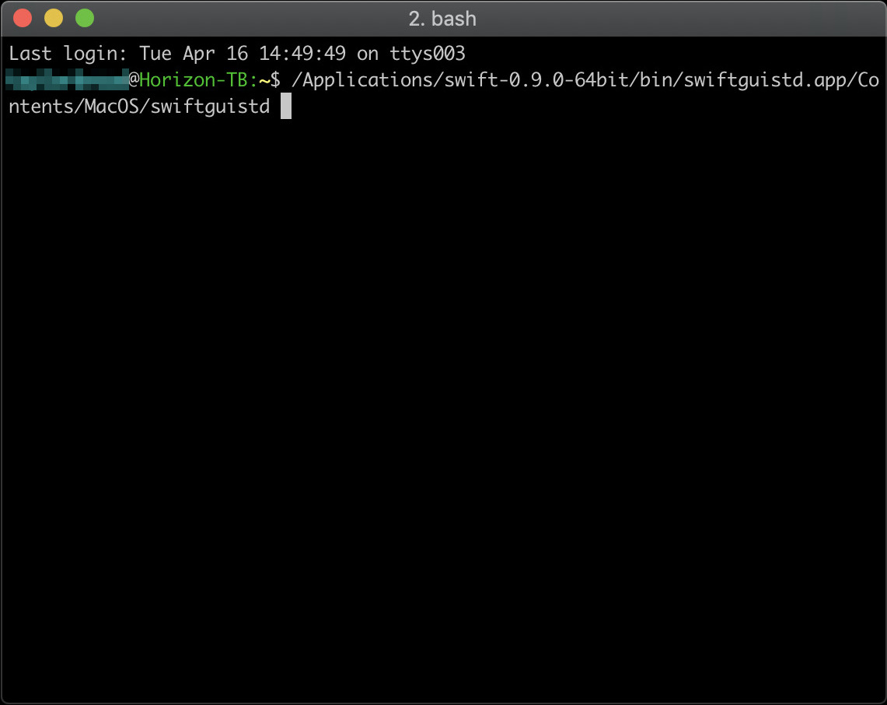

<!--
    SPDX-FileCopyrightText: Copyright (C) swift Project Community / Contributors
    SPDX-License-Identifier: GFDL-1.3-only
-->

Make sure you have the MIC (microphone) enabled for *swift*.

{: style="width:70%"}

- There is a bug currently being investigated.
- macOS seems to be very picky about app bundle info.plist.
  No matter what we add to it, it just won't work without any warning.
- Workaround: Open the swiftguistd application bundle content and drag the internal binary into console.
  That should work

{: style="width:70%"}

{: style="width:70%"}

{: style="width:70%"}
