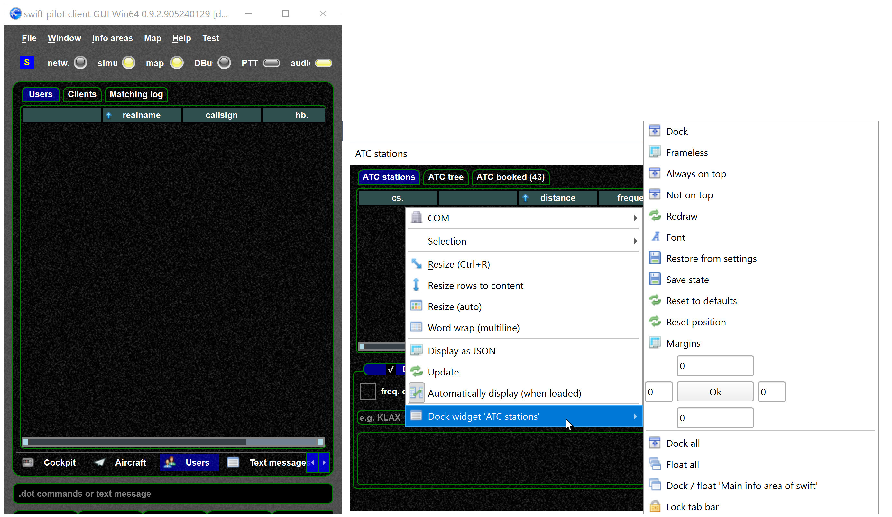
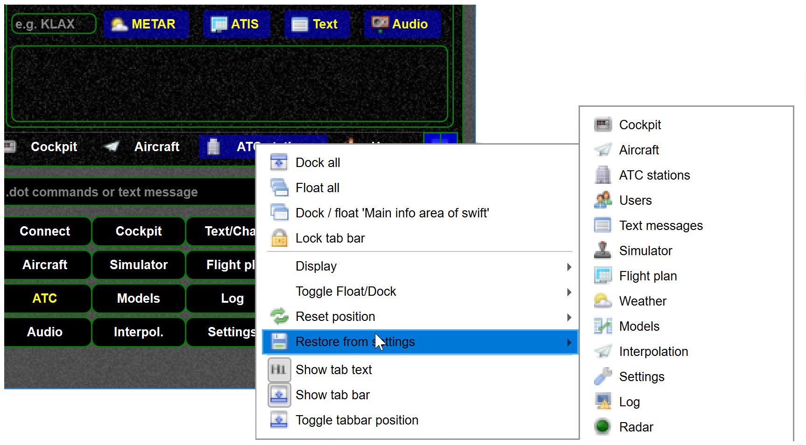

<!--
    SPDX-FileCopyrightText: Copyright (C) swift Project Community / Contributors
    SPDX-License-Identifier: GFDL-1.3-only
-->

See also [swift UI concepts](./ui_concepts.md)

If a window is floating the state can be saved

Such a state can be later restored

