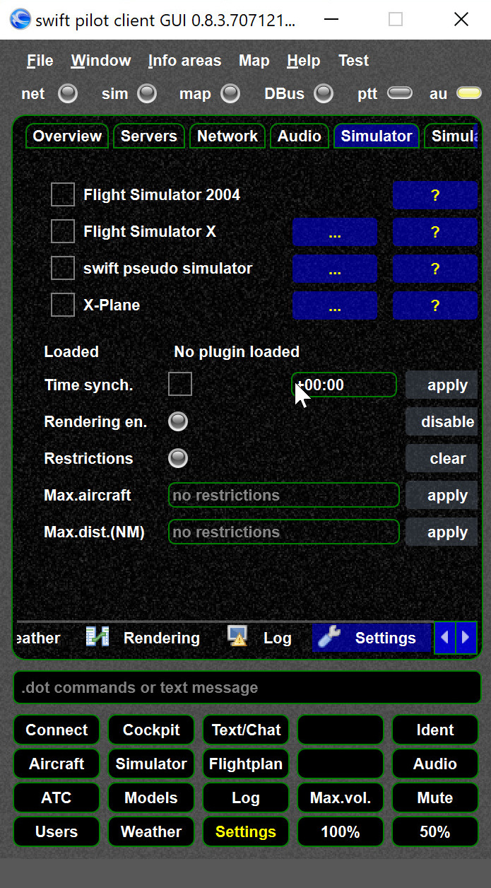

<!--
    SPDX-FileCopyrightText: Copyright (C) swift Project Community / Contributors
    SPDX-License-Identifier: GFDL-1.3-only
-->

- If NOT selected to the simulator the simulator LED is OFF.
- Make sure the used simulator is selected (checked)

{: style="width:50%"}

- If you **do NOT see any simulator on that page**, you did not install the corresponding plugin (aka driver)

{: style="width:70%"}

- **XPlane specific**: Verify the [xswiftbus settings](./../documentation/flying/settings/xswiftbus.md).
