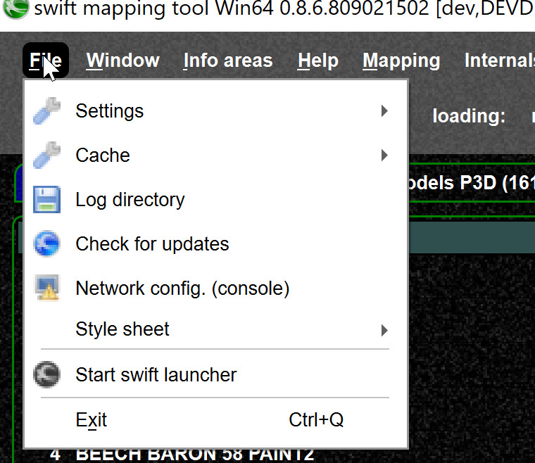
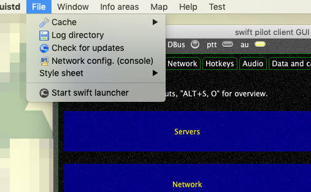
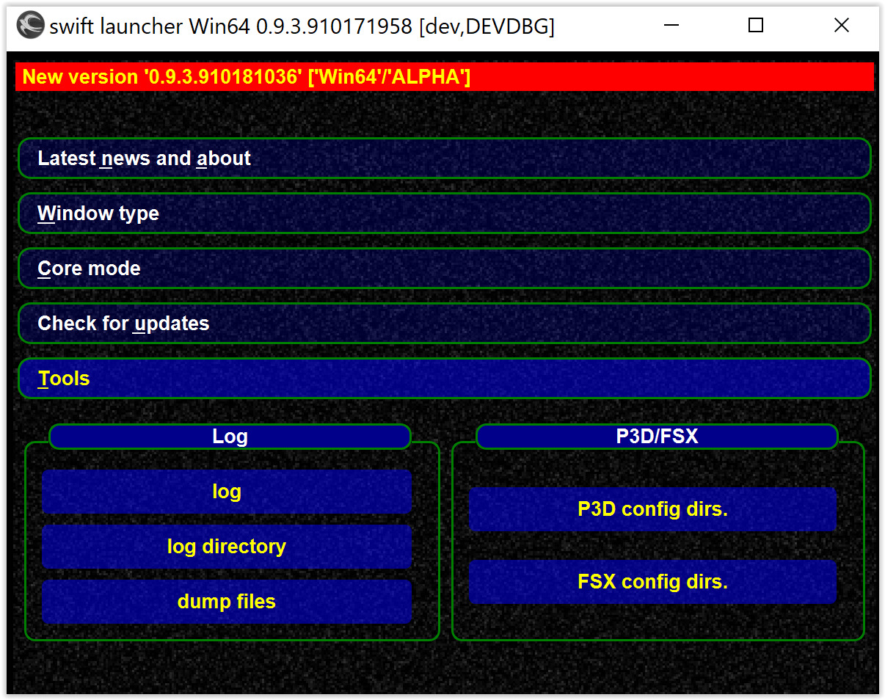
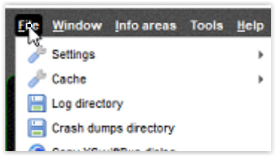
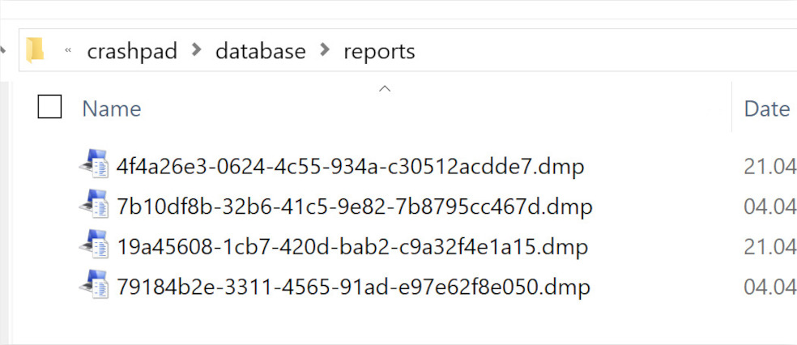
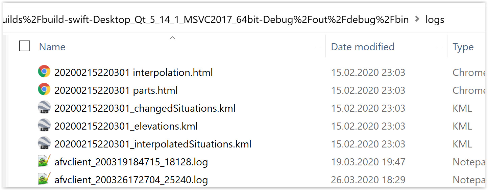

<!--
    SPDX-FileCopyrightText: Copyright (C) swift Project Community / Contributors
    SPDX-License-Identifier: GFDL-1.3-only
-->

The easiest way to find the swift log files is from the file menu:

{: style="width:50%"}

The path is something like here:

- `C:\Users\JoeDoe\AppData\Local\org.swift-project`
- Then some magic name representing your swift version, like `H%3A%2FProjects%2FQtBuilds%2Fbuild-swift-Desktop_Qt_5_11_1_MSVC2017_64bit2-Debug%2Fout%2Fdebug%2Fbin\logs`
- See also: [Find cache files](./cache_settings_location.md)

On MacOS, the Path is `\~/Library/ApplicationSupport/org.swift-project\`

{: style="width:50%"}

## Find files in launcher

In the launcher you can just go to ``TOOLS`` and open the directory there

{: style="width:50%"}

## Find the crashpad (aka crash dump) files

{: style="width:40%"}

The crashpad files are located next to the log directory, dmp are most useful file types.
See also [crash reports](./crash_reports.md).

{: style="width:70%"}

## Interpolation log. files

Interpolation log. files from [interpolation log](./interpolation_log.md) can also be found in the log. directory, all files for one timestamp belong to the same session.
If you want to UPLOAD those files, zip them together in one archive.

{: style="width:70%"}
