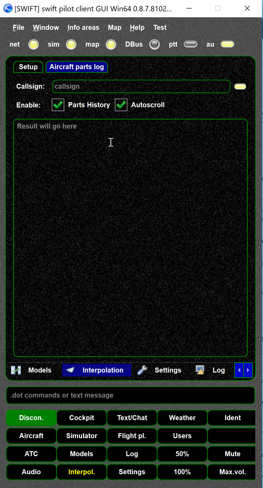
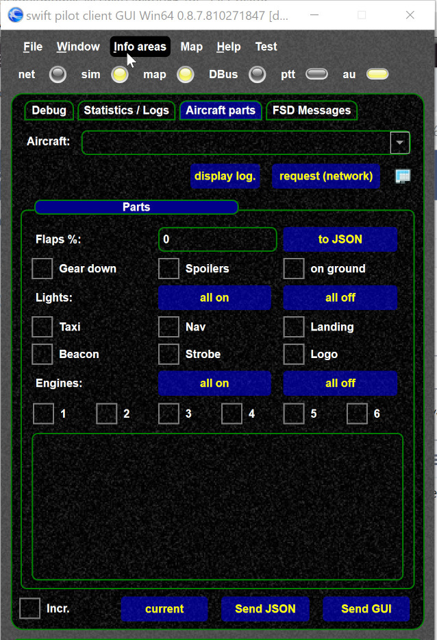

<!--
    SPDX-FileCopyrightText: Copyright (C) swift Project Community / Contributors
    SPDX-License-Identifier: GFDL-1.3-only
-->

To trace aircraft parts you have multiple options:

- Use the interpolation "parts" tab, there you can monitor aircraft parts.

    {: style="width:50%"}

- Use the internals page.
  You can override the values by using the `send` functions.
  You can "fake" received parts by just setting the GUI values and "Send GUI".
  This generates a packet like it was received from another swift client.

    {: style="width:50%"}

- You can also use the [interpolation page](./../documentation/swift_gui/interpolation_page.md)
- or if you just want to test offline [model browser](./model_browser.md)
- See also [interpolation examples](./interpolation_examples.md)
