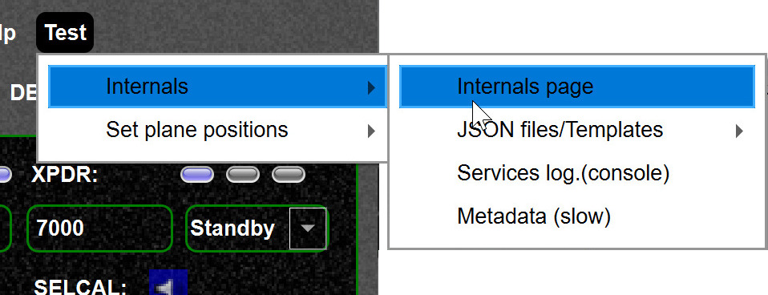
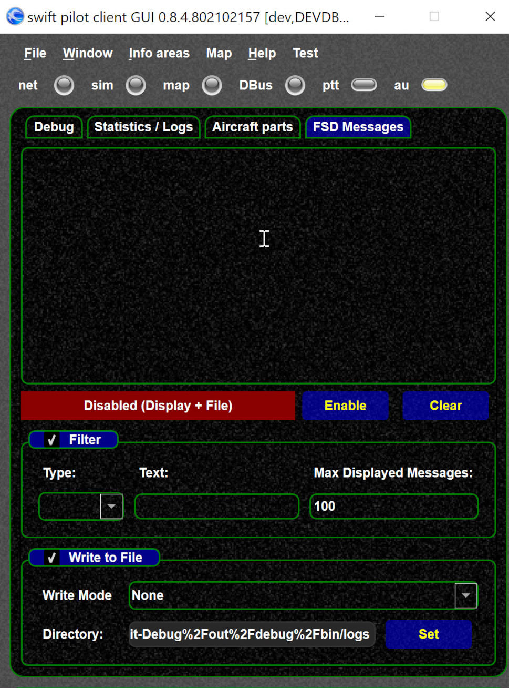
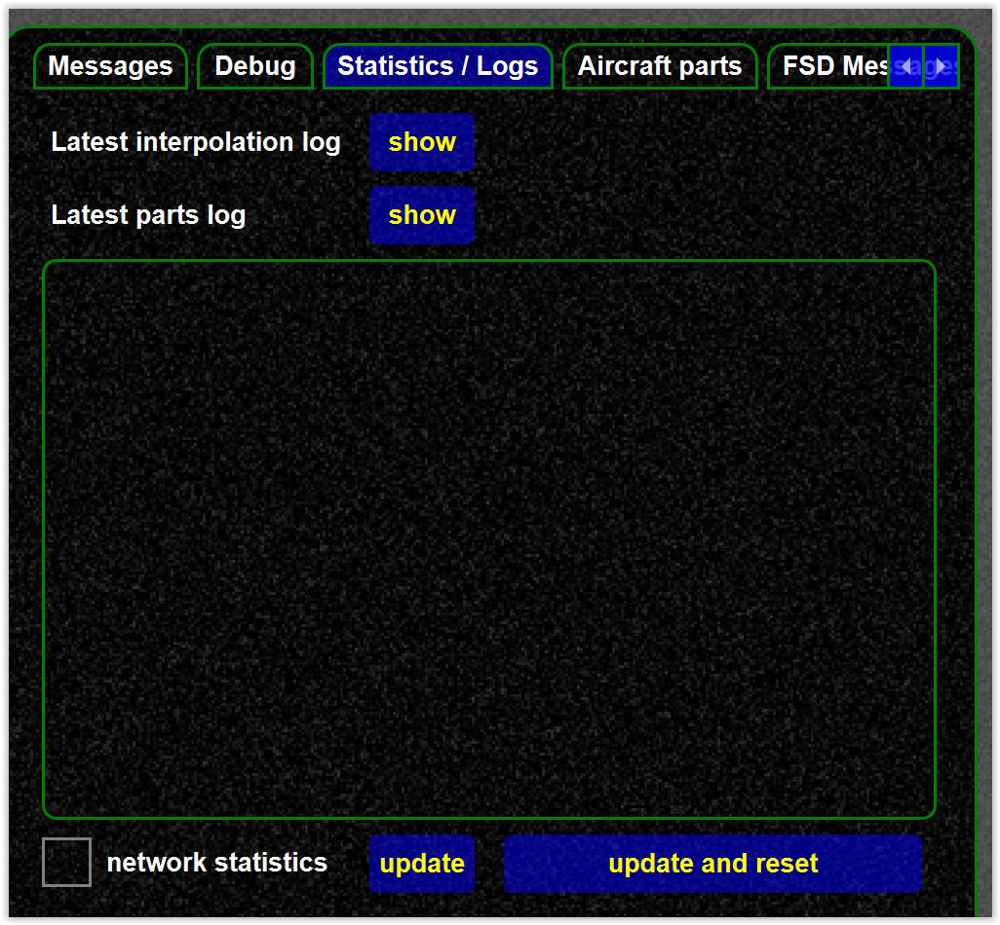

<!--
    SPDX-FileCopyrightText: Copyright (C) swift Project Community / Contributors
    SPDX-License-Identifier: GFDL-1.3-only
-->

{: style="width:70%"}

## Network packets

Network packets (FSD log) can be analyzed from the internals page.

{: style="width:50%"}

## Network statistics

Network statistics can be enabled from the internals page.
Also a log file is written to the log directory if enabled, see [find cache files](./cache_settings_location.md).

{: style="width:50%"}
