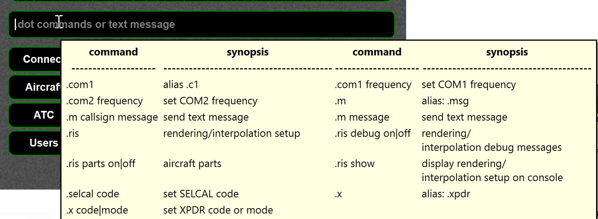
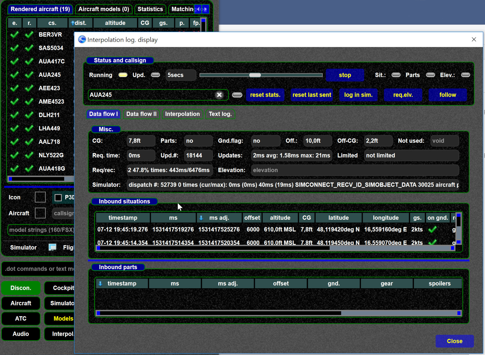
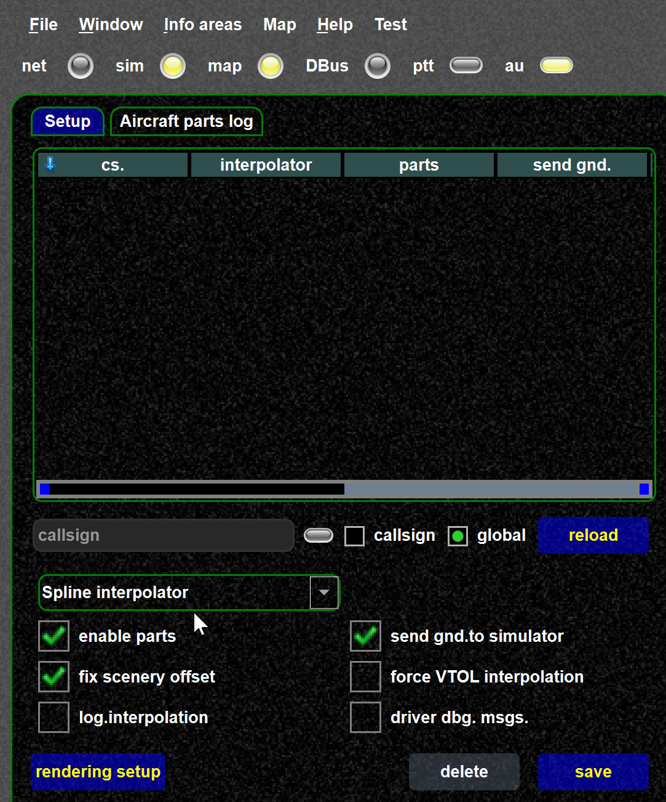
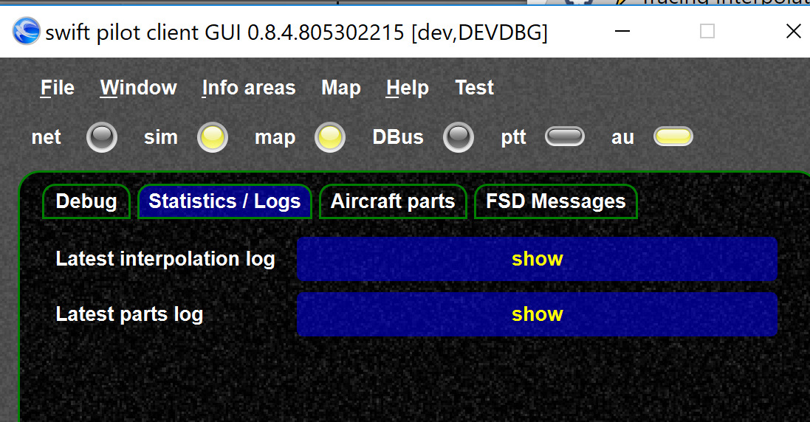
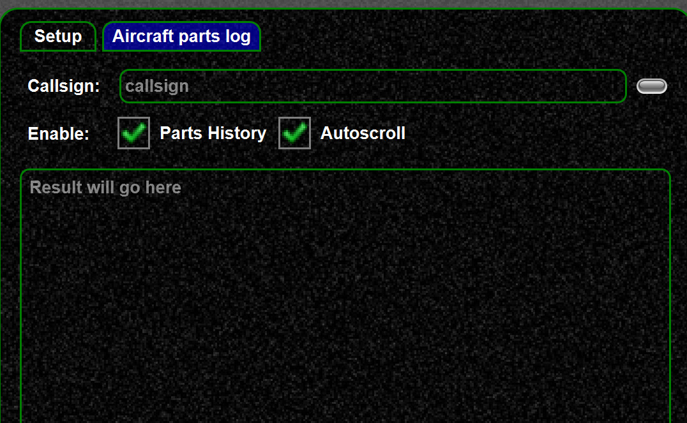
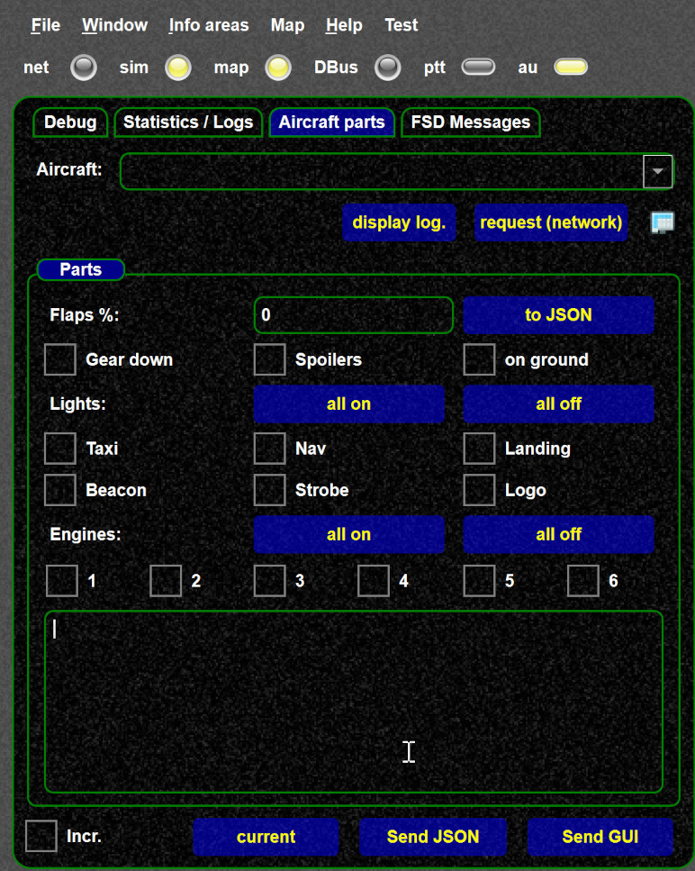

<!--
    SPDX-FileCopyrightText: Copyright (C) swift Project Community / Contributors
    SPDX-License-Identifier: GFDL-1.3-only
-->

!!! tip

    Use the "dot" command help to see which commands can be used to enable interpolation logging

{: style="width:70%"}

## Overview

There are 3 possibilities to get interpolation information:

- in an extra window of swift (since 0.8.4): [interpolation page](./../documentation/swift_gui/interpolation_page.md)
- in the message window of XPlane/FSX/P3D.
  You can send the current interpolated situation as message to the sim, which is useful if you want so see it in the simulator together with the aircraft
- or saved into a log file in HTML format which can also be read by spreadsheet programs.
  (HTML table will be created from that, which also be imported by Excel and similar spreadsheet programs)

HINT: You can enable logging for `1..n` aircraft, but only use ONE aircraft if there is no special need

## Interpolation log display

The interpolation log. display allows to trace interpolation, checking elevations, inbound parts and situations.
It is most likely the easiest was to trace interpolations.

Use `.drv intdisplay` to launch the window.
See [interpolation page](./../documentation/swift_gui/interpolation_page.md) for details.

{: style="width:70%"}

## Full HTML log

- You can enable tracing via the dot command `.drv logint CALLSIGN`.
  Alternatively logging can be enabled (or checked if it is enabled) in interpolation setup.
  You should see an info in the log./status bar

    {: style="width:70%"}

- if you want to end the logging, you would type `.drv logint write`, this should show

    {: style="width:70%"}

- the logging is very VERBOSE, so we recommend **ONLY to log one callsign at a time**
- do not log for too long, as said, the logs files get huge very quickly
- you will find the situation and parts logs generated in the log directory (they will be written if you type `.drv logint write`)
- If you have no idea how to find the log directory, see [find log files](./swift_log_files.md)

{: style="width:70%"}

The complete log can be obtained as HTML from the *Internals* page

{: style="width:70%"}

## Testing aircraft parts

In interpolation setup (on the 2nd tab) you could check the aircraft parts if needed.

{: style="width:70%"}

For testing parts you can also use the *Internals* page for sending parts.

{: style="width:70%"}
