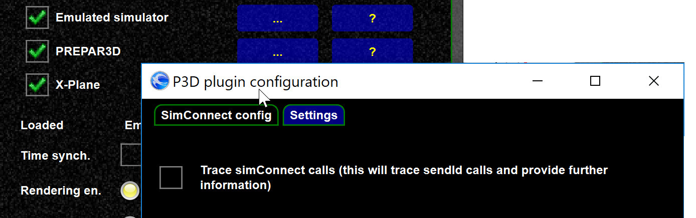

<!--
    SPDX-FileCopyrightText: Copyright (C) swift Project Community / Contributors
    SPDX-License-Identifier: GFDL-1.3-only
-->

If you notice (permanent) problems with FSX/P3D you can enable `SimConnect` tracing.
This will add further details to `SimConnect` exceptions as it will trace where a certain `SimConnect` calls originate from.

{: style="width:80%"}
