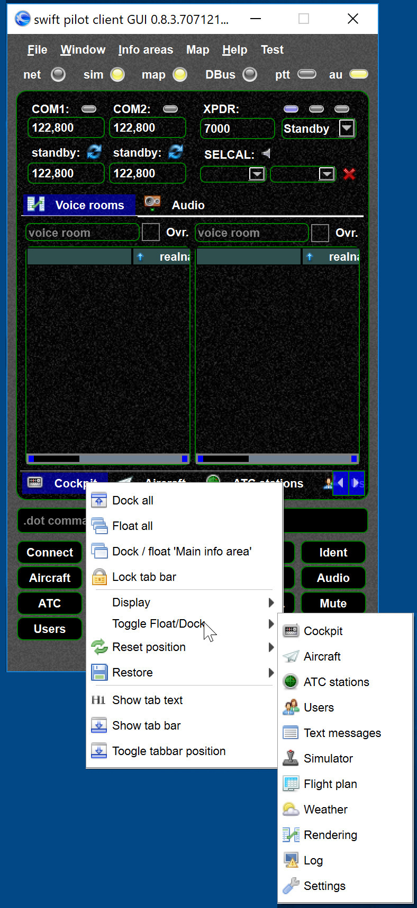
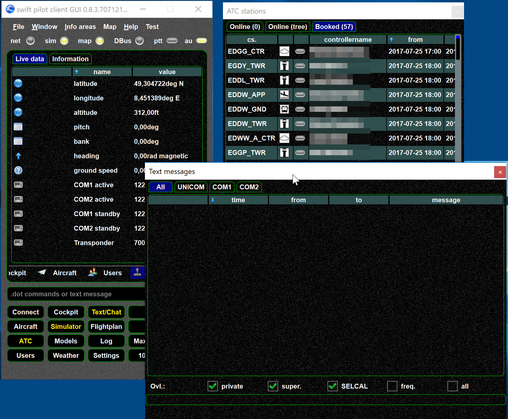
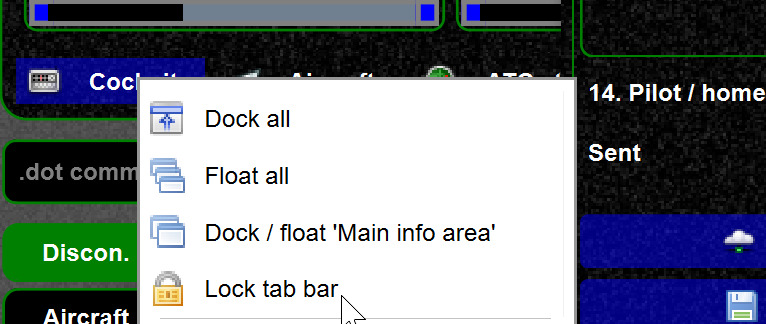

<!--
    SPDX-FileCopyrightText: Copyright (C) swift Project Community / Contributors
    SPDX-License-Identifier: GFDL-1.3-only
-->

## Windows

*swift* can be run as single window application (with tab bars) or the windows can be detached (double click on its tab or use the context menu).

{: style="width:70%"}

{: style="width:70%"}

Detaching of Windows can be locked.
Note that 3 buttons are yellow because the window is either floating or active.

{: style="width:70%"}

## Save and restore window states

See [Save Window](./save_window.md)

## Reset screen size

See [Reset screen size](./../documentation/flying/settings/reset_screen_size.md)

## Use tooltips

In many cases further information can be obtained by using the tooltips.
Just place your pointer of a field or label.

## Font size

Use `CTRL +`, `CTRL -` or `CTRL 0` to increase, decrease or reset font size.

## Resize views

- Use `CTRL R`
- Use the resize features from the context menu, try what works best for you
