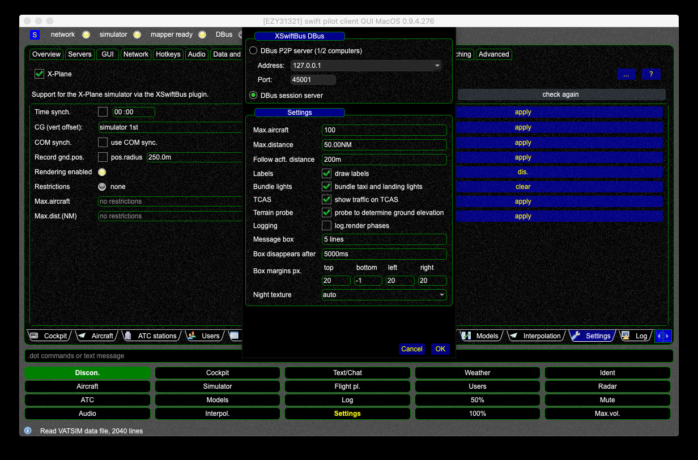
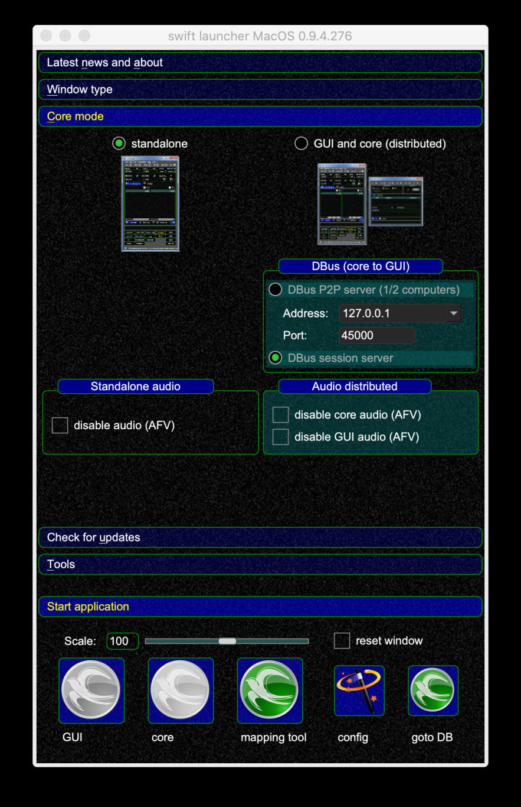

<!--
    SPDX-FileCopyrightText: Copyright (C) swift Project Community / Contributors
    SPDX-License-Identifier: GFDL-1.3-only
-->

For some people swift only works with session bus on macOS.

Reason: UNKNOWN, if you figure it out - let us know!

Reported for: Mac OS 10.15.4

Here it is shown how to switch to session bus:

In the launcher:

{: style="width:70%"}
